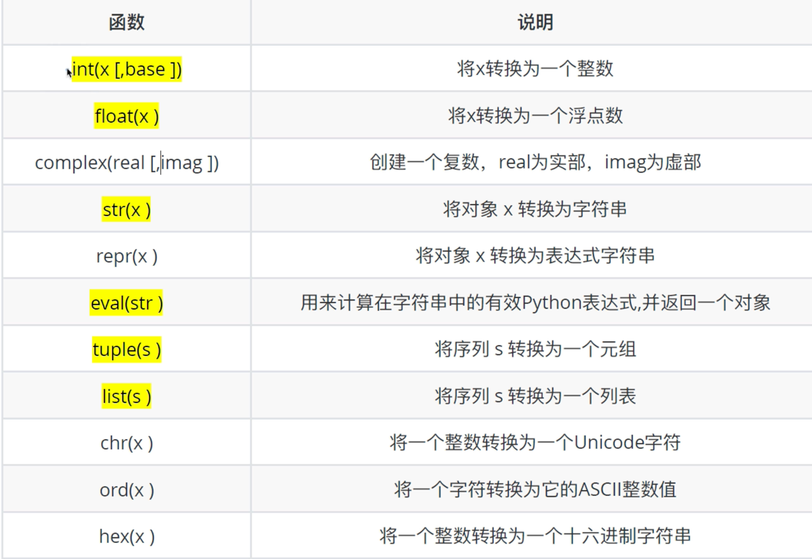

# 数据类型转换和运算符

## 1. 输入

### 1.1 输入的语法

```python
input('提示信息')
```

### 1.2 输入的特点

1. 当程序执行到`input`时，等待用户输入，输入完成后再继续向下执行
2. `input`接受用户输入后一般储存到变量，方便使用
3. `input`会把接收到的任意用户输入的数据**都当做字符串**处理

```python
>>> psw = input('请输入密码: ')
请输入密码: 123
>>> print(f'您输入的密码是{psw}。')
您输入的密码是123。
```

## 2. 转换数据类型

### 2.1 转换数据类型的函数



```python
>>> psw = input('请输入密码:\n ')
请输入密码:
 123
>>> type(psw)
<class 'str'>
>>> int(psw)
123
>>> type(psw)
<class 'str'>
```

可以看到在使用int(psw)时获取了一个int类型的数据，但psw的类型其实没有变化

不是所有字符串都可以转换成int或float

```python
>>> str = '1'
>>> float(str)
1.0
>>> str = 'a'
>>> float(str)
Traceback (most recent call last):
  File "<stdin>", line 1, in <module>
ValueError: could not convert string to float: 'a'
```

eval: 将str转换成它原本的类型

```python
>>> str1 = '1'
>>> type(eval(str1))
<class 'int'>

>>> str2 = '1.2'
>>> type(eval(str2))
<class 'float'>

>>> str3 = '[1, 2, 3]'
>>> type(eval(str3))
<class 'list'>

>>> str4 = '(1, 2, 3)'
>>> type(eval(str4))
<class 'tuple'>

>>> str5 = "{'key1': 1, 'key2': 2, 'key3': 3}"
>>> type(eval(str5))
<class 'dict'>
```

## 3. 运算符

1. 分类

+ 算数运算符
+ 赋值运算符
+ 复合赋值运算符
+ 比较运算符
+ 逻辑运算符

2. 优先级

`()`高于`**`高于`*` `/` `//` `%`高于`+` `-`

### 3.1 算术运算符

| 运算符           | 描述             |
| ---------------- | ---------------- |
| `+` `-`          | 加，减           |
| `*` `/` `%` `//` | 乘，除，模，整除 |
| `**`             | 指数             |

```python
>>> 2+3
5
>>> 2*3
6
>>> 2-3
-1
>>> 15/4
3.75
>>> 15%4
3
>>> 15//4
3
>>> 2**3
8
```

**除法得到的结果一定是float类型**这和C/C++，java等语言不一样。C/C++，java等语言的`/`相当于python的`//`

### 3.2 赋值运算符

| 运算符 | 描述 |
| ------ | ---- |
| `=`    | 等于 |

#### 3.2.1单个变量赋值

```python
>>> a = 3
>>> a
3
```

#### 3.2.2多个变量赋值

```python
>>> a, b, c= 1, 2.3, '4'
>>> a
1
>>> b
2.3
>>> c
'4'

>>> a = b = 10
>>> a
10
>>> b
10
```

### 3.3 复合赋值运算符

`+=` `-=` `*=` `/=` `%=` `//=` `**=` `&=` `|=` `^=` `>>=` `<<=`

和其他语言基本相同

### 3.4 比较运算

| 表达式 | 描述     |
| ------ | -------- |
| `>`    | 大于     |
| `<`    | 小于     |
| `==`   | 等于     |
| `>=`   | 大于等于 |
| `<=`   | 小于等于 |
| '!='   | 不等于   |

会返回一个bool类型的值

### 3.5 逻辑运算符

| 表达式 | 描述 |
| ------ | ---- |
| `and`  | 大于 |
| `or`   | 小于 |
| `not`  | 等于 |

表达式之间的逻辑运算和正常的一样

数字之间的逻辑运算

`and`: 若一个数字为0则结果为0，否则结果为最后一个非0数字

`or`: 只有所有值为0结果才为0，否则结果为第一个非0数字

