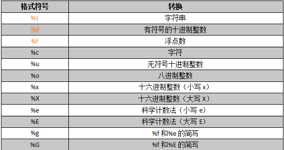

# 输出

## 1. 格式化输出

### 1.1 格式化符号



### 1.2 使用方法

```python
age = 20
name = 'xx'
sno = 1
weight = 75.5

# 1. 今天我的年龄是x岁
print('今天我的年龄是%d岁' % age)

# 2. 我的名字是x
print('我的名字是%s' % name)

# 3. 我的体重是x公斤(保留两位小数)
print('我的体重是%.2f公斤' % weight)

# 4. 我的学号是x（要求输出00001）
print('我的学号是%04d' % sno)

# 5. 我的名字是x，今年x岁了，我的学号是x。
print('我的名字是%s，今年%d岁了，我的学号是%04d' % (name, age, sno))
```

> + %.2f: 浮点数保留两位小数
> + %04d: 整数不足4位在前面补0

### 1.3 格式化字符串拓展

```python
>>> # 将数据以字符串的形式输出
>>> print('我的名字是%s，今年%s岁了，我的体重是%s公斤' % (name, age, weight))
我的名字是xx，今年20岁了，我的体重是75.5公斤
```

### 1.4 f格式化字符串

格式化字符串除了%s还可以用`f'{}'`来格式化输出

```python
>>> # f格式化字符串
>>> print(f'我的名字是{name}，今年{age}岁了，我的体重是{weight}公斤')
我的名字是xx，今年20岁了，我的体重是75.5公斤
```

### 1.5 转义字符

+ `\n`: 换行
+ `\t`: 制表符，一个tab键的距离

在Python中，print函数默认自带`end='\n'`（相当于java中的println）

若要取消其换行可以加上`print('内容', end=None)`

```python
# 换行输出
print('hello\nPython')
```

### 1.6 print函数结束符

```python
print('hello', end=' ')
print('world')
print('hello', end=' ')
print('Python')
```