Todo：

第三章

UDP检验和

第四章视频

IP分组转发演示视频

问一下chat**最长前缀匹配算法**

RIP协议如何更新

NAT

## 第一章

三种交换的区别

分组交换的性能：shiyan，利用率

封装和解封、复用和分用

### 1.1  交换

#### 1.1.1 电路交换

+ 电路交换属于**通信资源的预分配系统**。

+ 电路交换方式是**面向连接**的交换方式。必须经过：

1. 建立连接：例如打电话拨号；

2. 数据传输：例如通话；

3. 释放连接：例如挂断电话。

+ 中继线中多路电话信号可以通过**频分多路复用**、**时分多路复用**等信道复用技术共享通信线路资源。

+ **特点**：

+ 固定分配资源：通信资源在建立连接阶段已经预先分配给通话的双方了，在通话的全部时间内，通话的两个终端始终占用端到端的通信资源。

#### 1.1.2 分组交换

+ 计算机网络数据具有突发特性，如果使用电路交换方式，通信资源的利用率将极低。

+ 因此，计算机网络采用**分组交换**方式。分组交换技术的出现奠定了互联网发展的基础。

+ 分组交换属于**通信资源的动态分配系统。**

+ **特点：**
  分组；
  存储转发；
  逐段占用通信链路资源；
  虚电路或数据报。

虚电路方式：

+ **虚电路方式是面向连接的**，虚电路中连接，不是物理连接，只是一条**逻辑连接**。

+ 建立虚电路后，在数据通信阶段，路由器根据虚电路标识转发分组，属于相同虚电路的数据分组将**沿着相同的路径、按序**通过网络，到达目的结点。

数据报方式：

+ **数据报方式是无连接的**，即发送数据之前不需要先建立连接。

+ 数据报方式中，路由器为每个分组独立选择转发接口，从相同源结点发往相同目的结点的数据分组，有可能**沿着不同的路径**，也有可能**失序**通过网络，到达目的结点。

#### 1.1.3 报文交换

+ 报文交换方式也采用存储转发方式。

+ 报文交换与分组交换的区别在于：**报文交换传输的数据单元是一个完整的报文**，而分组交换传输的数据单元是较小的分组。

#### 1.1.4 三种交换方式的对比


### 1.2 性能指标

#### 1. 带宽

**数据传输的速率**

带宽是“频带宽度”的简称，单位是赫兹（Hz）。

信号的带宽指该信号所包含的各种不同频率成分所占据的频率范围；

信道的带宽指该信道允许通过的信号的频带范围。

如：传统的电话信号的标准带宽是3.1kHz（从300Hz到3.4kHz），传统的电话信道的标准带宽是4kHz（从0Hz到4kHz）。

在计算机网络中，带宽是指在单位时间内能传输的最大数据量，也称为最高数据率，用来表示网络中某信道的数据传送能力，单位是比特每秒（b/s）。

如：传统以太网的带宽是10Mb/s。

在带宽的两种表述中，其本质是相同的，前者是其频域称谓，后者是其时域称谓。

#### 2. 吞吐量

吞吐量表示在单位时间内通过某个网络或接口的实际数据量，单位是比特每秒（b/s）。

以文件传输应用为例，主机在任何瞬间接收到该文件的速率称为瞬时吞吐量，主机收到完整文件后计算的平均速率称为平均吞吐量。

端到端吞吐量是衡量计算机网络性能的一个重要指标。

端到端吞吐量受到网络带宽的限制。

端到端吞吐量也会受到网络中其他通信量的影响。

#### 3. 延迟

分组从源主机出发，经过一系列路由器，最终到达目的主机，在这个过程中所花费的时间称为端到端延迟。端到端延迟由处理延迟（processing delay）、排队延迟（queuing delay）、传输延迟（transmission delay）和传播延迟（propagation delay）等几个部分组成。

处理延迟：结点在收到分组后，结点处理分组所花费的时间，称为处理延迟。

排队延迟：分组进入路由器后，在输入队列或输出队列中排队所产生的延迟称为排队延迟。


**往返的端到端延迟通常称为往返时间（Round-Trip Time，RTT）**

#### 4. 丢包率

当分组到达路由器的速率超过路由器发送分组的速率时，路由器有可能丢弃到达的分组，这种现象称为丢包。

丢包代表网络出现了拥塞。丢包率在很大程度上反映网络的阻塞程度，常被用于评价和衡量网络性能。


其中N<sub>s</sub>代表发送的分组总数，N<sub>r</sub>代表收到的分组总数，N<sub>s</sub>-N<sub>r</sub>代表丢失的分组总数。

#### 5. 利用率

利用率包括信道利用率和网络利用率两种。

信道利用率指出某信道被利用(有数据通过)的时间占全部时间的百分比。

网络利用率则是全网络的信道利用率的加权平均值。

信道利用率并非越高越好。当某信道的利用率增大时，该信道引起的延迟也会迅速增加。

在适当的假定条件下，延迟和网络利用率之间的关系如下式：

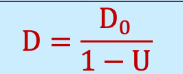

其中，D表示网络当前的延迟，D<sub>0</sub>表示网络空闲时的延迟，U是网络的利用率。

信道或网络的利用率过高会产生非常大的延迟。

#### 6. 延迟带宽积

**延迟带宽积=延迟×带宽**

当采用不同种类的延迟时，延迟带宽积有不同的含义。

采用相邻结点间的传播延迟，则延迟带宽积的含义：信道的容量，或者说当接收结点收到第1个比特时，发送结点可以发送的比特数。（最常见）

类比：如果我们把信道看成中空的管道，则延迟相当于管道的长度，带宽相当于管道的截面积，那么延迟带宽积相当于管道的容积。

采用单向端到端延迟，则延迟带宽积的含义：逻辑信道的容量，或者说当最终的接收方收到第1个比特时，发送方可以发送的比特数。

采用往返时间RTT，则延迟带宽积的含义：当发送方收到来自接收方的确认信息时，发送方可以发送的比特数。（最有用）

用途：在可靠传输协议设计中，通常要求发送方收到对上一批数据的确认后，才能继续发送下一批数据。在这类协议中，为了充分利用网络带宽资源，不让发送方因为等待确认信息而暂停发送，就应该允许发送方每一批发送的数据都大于RTT×带宽。重要参数

### 1.3 例题

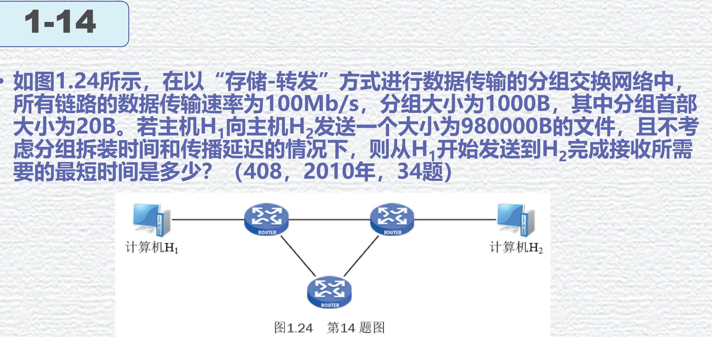

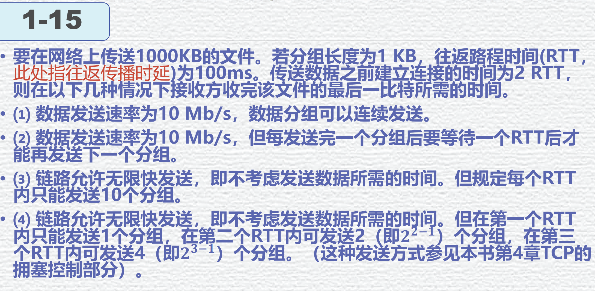

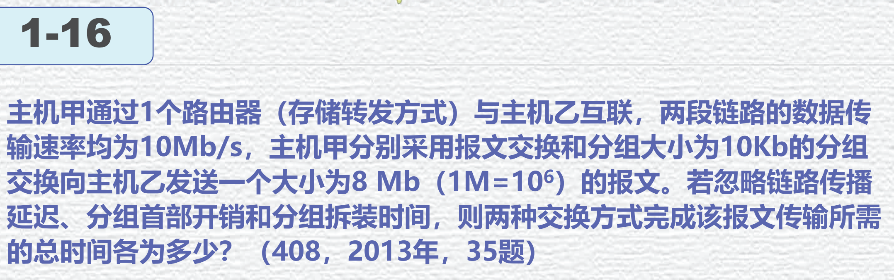

## 第二章：IP地址


理解：点分十进制、分类编制

*应用：子网划分、无分类编址（两个三个定长的，几个不定长的）、IP地址规划和分配


### 2.1 点分十进制

把32位的IP地址分为4组，每组8位，然后将每组数字用十进制表示，并且在这些数字之间加上一个点，就称为IP地址的点分十进制记法。

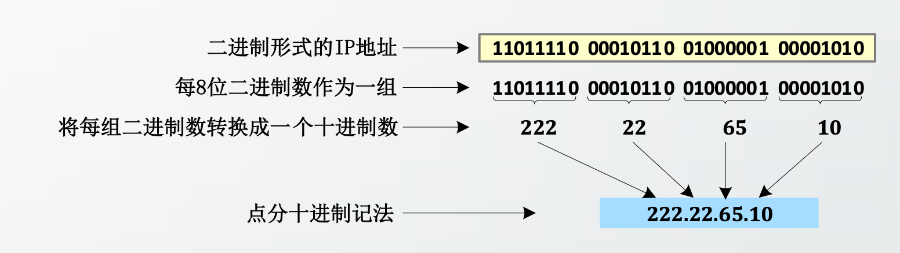

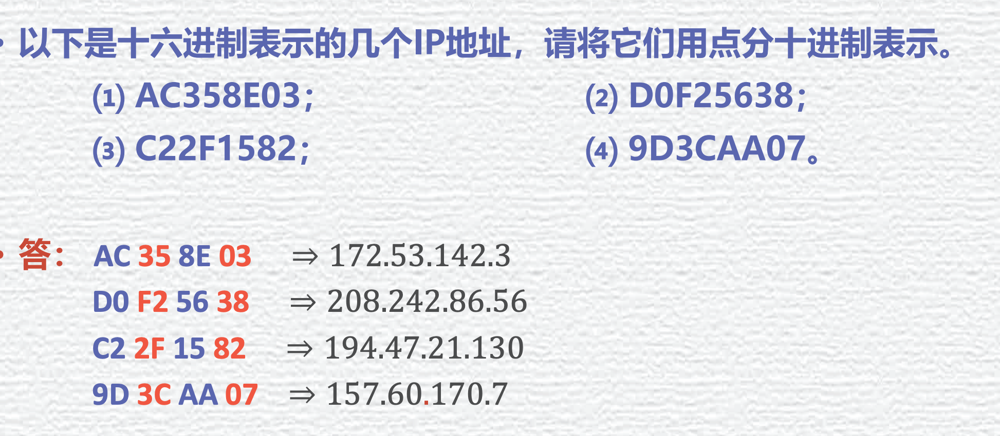

### 2.2 IP网络的分层结构

+ IP地址采用了**分层**（hierarchical）结构，即IP地址由与互联网特定层次结构对应的几部分构成。 
+ IP地址包括两部分：**网络部分**和**主机部分**。
+ IP地址的网络部分指明了主机所连网络，同一网络中，所有主机的IP地址的网络部分相同。
+ IP地址的主机部分唯一标识了特定网络中的特定的主机。
+ 采用分层结构的IP地址后，路由器可以仅根据IP地址的网络部分来转发分组，而无需考虑IP地址的主机部分。

### 2.3 编址方案

IP地址的编址方案经历了三个历史阶段：

① 有类别编址。将IP地址分为A、B、C、D、E五类，是最基本的编址方案，在1981年通过的RFC790中就包含了A、B、C类地址的相关规定。

② 子网划分。是在有类别编址的基础上所作的改进，1985年通过的RFC950中包含了相关的规定。

③ 无类别编址。基于无类别域间路由选择（Classless Inter-Domain Routing，CIDR）的编址方案，是目前正在使用的编址方案。在1993年通过的RFC1519中提出后，很快就得到推广应用。2006年，RFC1519被RFC4632替换。

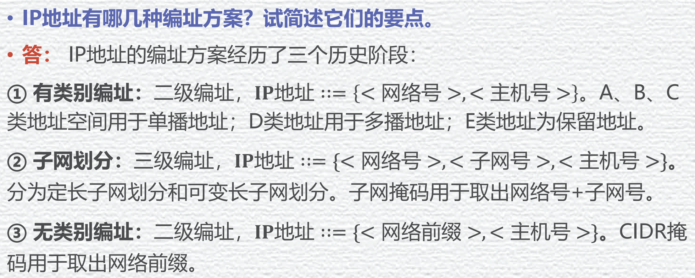

### 2.4 有类别编址

#### 2.4.1 分类的IP地址

有类别编址方案采用两级编址，每个单播IP地址都由两个字段组成。
$$
𝐈𝐏地址∷={<网络号>, <主机号>}
$$
其中，网络部分是网络号；主机部分是主机号。

现实中，不同的网络可能包含不同数量的主机，一种划分方法是依据当前实际或预计的主机数量，将不同大小的IP地址空间分配给不同的网络。

不同类别的IP地址，它们的网络号和主机号长度不同。 

路由器根据IP地址的网络部分来转发分组。

#### 2.4.2 A类、B类和C类IP地址

IP地址空间被划分为五类，命名为A、B、C、D和E。

A、B、C类为单播地址；

D类地址为多播地址；

E类地址为保留地址

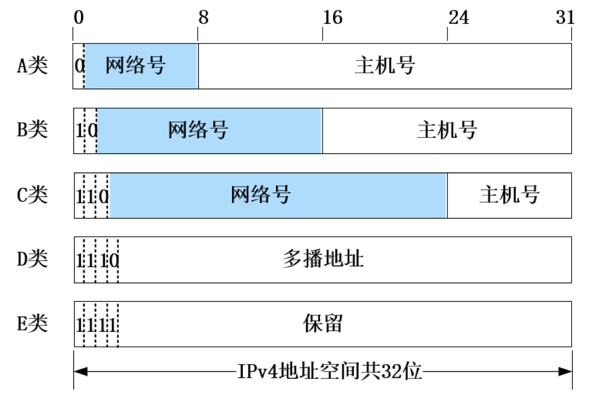

A类、B类和C类地址属于单播地址，由网络号和主机号两部分组成。在单播地址空间中，有部分地址被用作特殊用途，不作为单播地址使用。

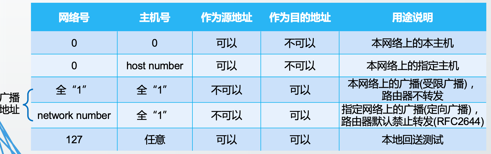

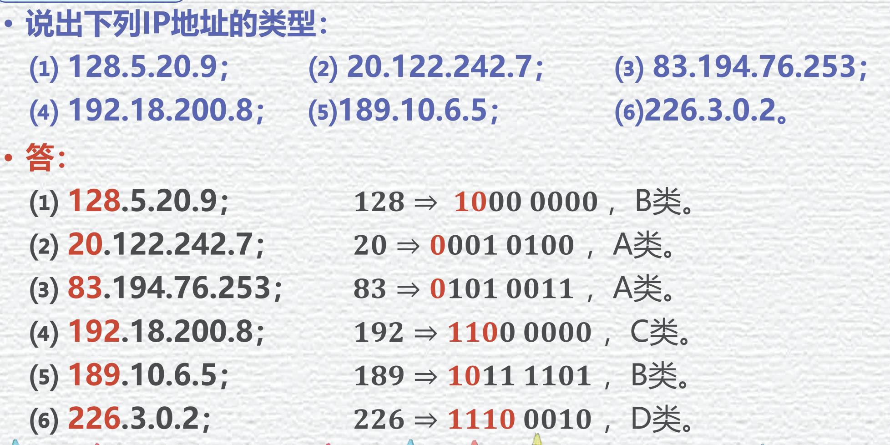

### 2.5 子网划分

一些较大的单位或组织内部需要组建多个局域网，在IP地址的两级编址方案下，为这些局域网分配IP地址有困难。

RFC950提出了子网划分，来解决这样的问题

子网划分将IP地址从两级编址方案扩展为三级编址方案，包括两种方式：

定长子网划分

可变长子网划分

#### 2.5.1 定长子网划分

子网划分的方法是从IP地址的主机号部分借用若干位作为子网号，这样，两级IP地址在本单位内部就变为三级IP地址。
$$
𝐈𝐏地址∷={<网络号>, <子网号>,<主机号>}
$$
互联网上的路由器仍然将网络号看作IP地址的网络部分；

单位的边界路由器和内部路由器将网络号+子网号记作网络地址，将网络地址看作IP地址的网络部分。

路由器根据IP地址的网络部分来转发分组。

一个例子：

以一个B类网络139.9.0.0为例讨论子网划分。假设申请到该B类地址的单位，从主机号部分借用8位作为子网号，则划分子网后的IP地址结构如图所示。

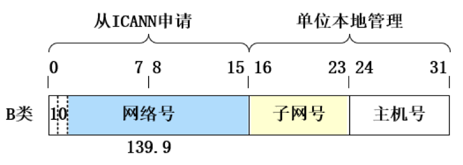

本例中，支持最多配置2^8=256个子网，每个子网最多可包含2^8−2=254台主机。

划分子网后，主机号为全“0”和全“1”的IP地址仍然不能指派给主机。

本例中所有子网的子网号长度相等，这种子网划分方式称为定长子网划分。

假设该单位已经组建了3个局域网，网络管理员为它们分配了子网号5、10和15，其余的子网号暂时保留。

划分子网后，B类网络139.9.0.0对外部仍表现为一个网络。

当边界路由器和内部路由器收到IP数据报后，按照网络地址转发分组。

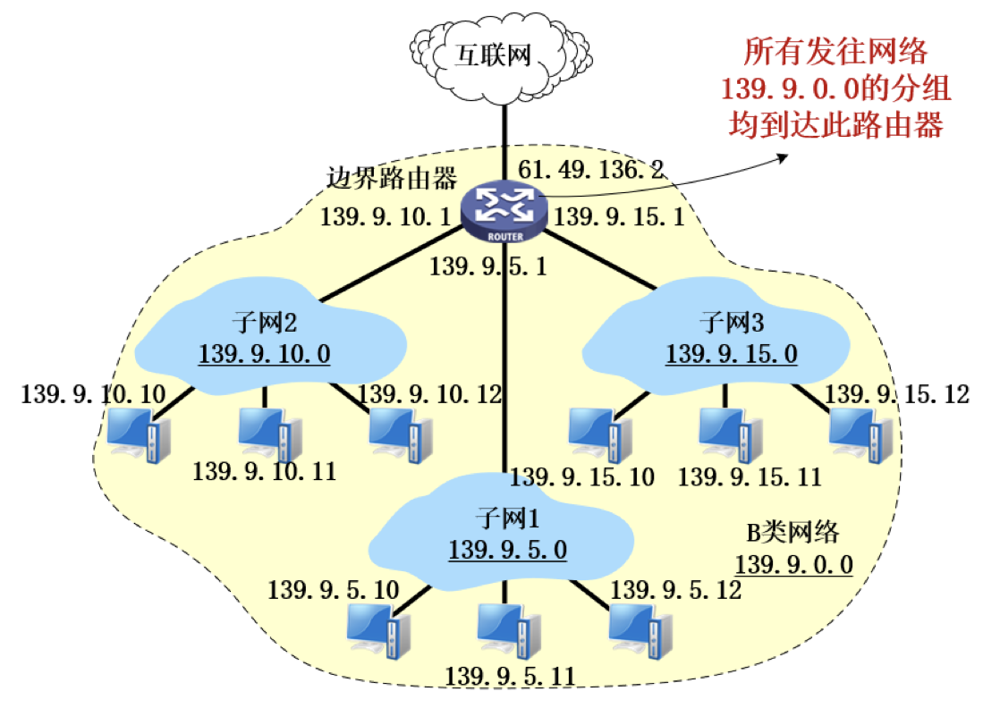

子网掩码

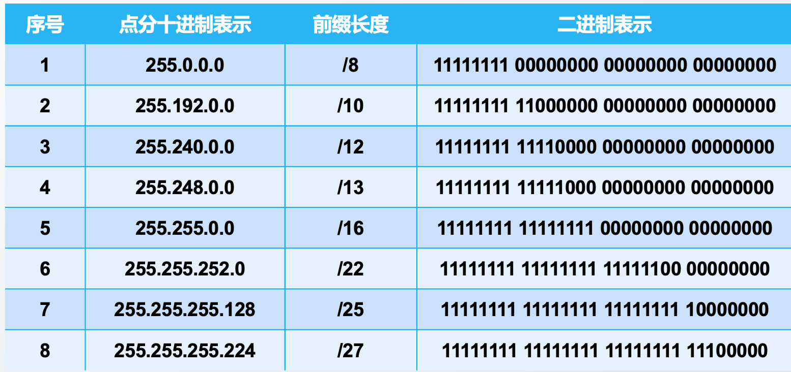

用子网掩码计算出真正的网络地址

+ 将IP地址与其子网掩码做按位与（AND）操作，即可得到相应的网络地址。
+ 如上例中，边界路由器收到目的IP地址为**139.9.10.11**的IP数据报，将该IP地址与子网掩码**255.255.255.0**做按位与操作的过程如下。
  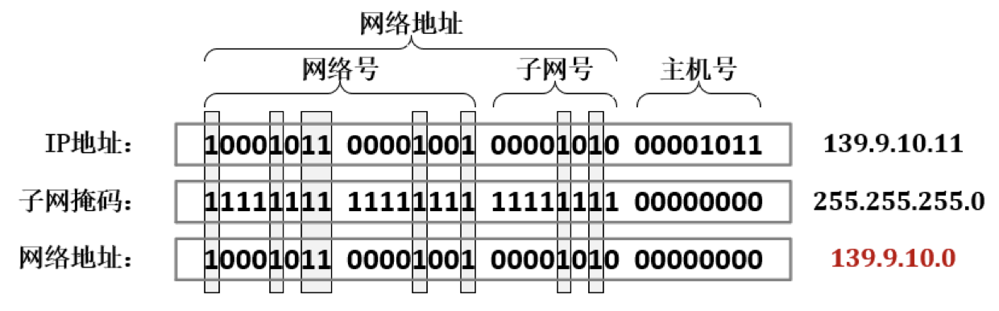
+ 计算得出网络地址为**139.9.10.0**

#### 2.5.2 可变长子网划分

如果将一个网络划分为多个大小不同的子网，以适应多个子网具有不同数量主机的需求。这种子网划分方式称为可变长子网划分。

在可变长子网划分中，各子网的子网号部分长度不尽相同，因此其子网掩码的前缀长度也不尽相同，这种子网掩码称为可变长子网掩码（VLSM） 。

在上小节定长子网划分的例子中，可以将子网1进一步划分为两个子网，将它们的子网掩码配置为255.255.255.128，即子网掩码前缀长度为25，从而得到一个可变长子网划分的实例。

进行了可变长子网划分后，整个网络对外部仍表现为一个网络。

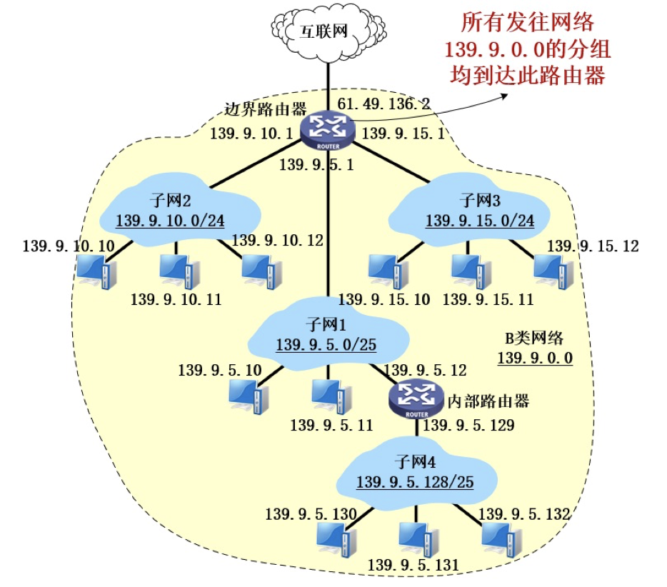

可变长子网掩码例子中的子网地址和子网掩码

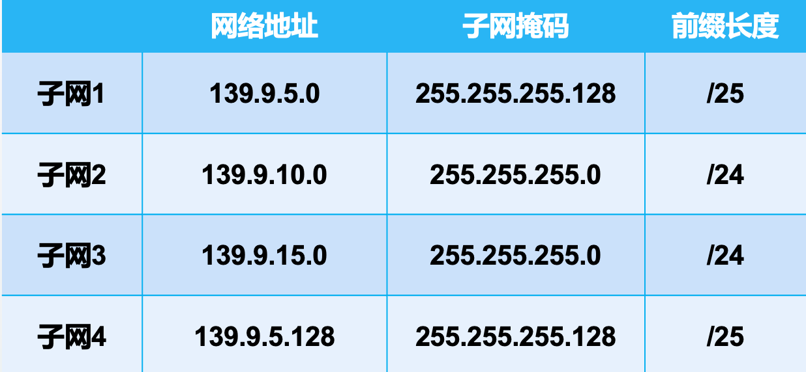

```
可变长子网划分（Variable Length Subnet Masking，VLSM）和定长子网划分（Fixed Length Subnet Masking，FLSM）是两种在计算机网络中划分子网的方法。

定长子网划分是一种简单的方法，其中每个子网都有相同数量的主机。在这种情况下，子网掩码是固定的，无论子网所需的主机数量如何，都采用相同的子网掩码。这意味着每个子网都具有相同的大小和可用主机数量。

例如，假设有一个IP地址段为192.168.0.0/24的网络，采用定长子网划分，每个子网都分配了一个/24的子网掩码。这意味着每个子网可以容纳256个主机。

可变长子网划分是一种更灵活的方法，其中不同的子网可以具有不同数量的主机。通过使用更长的子网掩码，可以将更多的IP地址用于网络前缀，从而划分出更小的子网。这种方法可以更有效地利用IP地址，并根据每个子网所需的主机数量进行灵活的划分。

例如，假设有一个IP地址段为192.168.0.0/24的网络，采用可变长子网划分，可以根据需要为不同的子网分配不同的子网掩码。例如，可以将一个子网划分为/26，它可以容纳64个主机，而另一个子网划分为/28，它只能容纳16个主机。

总结一下区别：
- 定长子网划分：所有子网具有相同数量的主机，子网掩码是固定的。
- 可变长子网划分：不同的子网可以具有不同数量的主机，使用更长的子网掩码来划分更小的子网。
```

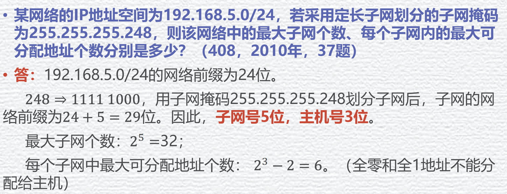


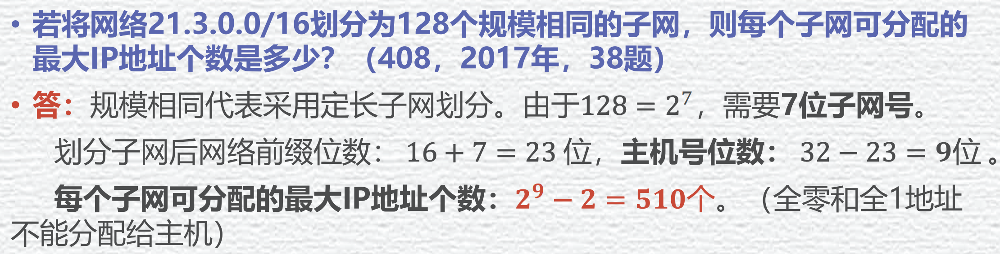

### 2.6 无类别编址

2.6.1 网络前缀

IETF在VLSM的基础上，研究出了无类别编址方案，它的正式名字是无分类域间路由选择（Classless Inter-Domain Routing，CIDR）。

CIDR消除了传统的A类、B类和C类地址以及划分子网的概念，可以更加有效地分配IPv4地址空间。

CIDR将IP地址从三级编址改回两级编址，但这已经是无类别的两级编址。
$$
𝐈𝐏地址∷={<网络前缀>, <主机号>}
$$
其中，网络部分是网络前缀；主机部分是主机号。

路由器根据IP地址的网络部分来转发分组。

CIDR采用斜线记法，也称为CIDR记法，即在IP地址后面加上斜线“/”，然后写上网络前缀所占的位数。

如IP地址：222.22.65.10/20的网络前缀为20位。

网络前缀消除了一个IP地址中网络和主机号的预定义分隔，使更细粒度的IP地址分配成为可能。

网络前缀都相同的连续的IP地址组成一个CIDR地址块。

一个例子：

已知CIDR地址块中的任何一个地址，就可以求出这个地址块的起始地址（即最小地址）和最大地址，以及地址块中的地址数。

主机号从最小到最大（全0到全1）

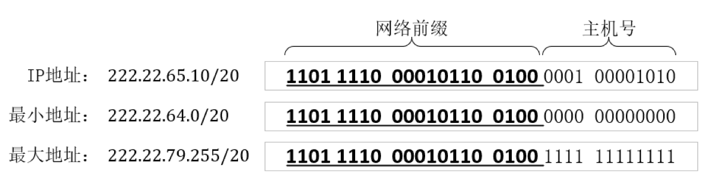

该地址块共有2^12=4096个地址，最大允许指派的主机数为2^12−2=4094个。

通常用地址块中的最小地址和网络前缀的位数标识地址块，上述地址块可记为222.22.64.0/20。

2.6.2 路由聚合

+ CIDR不仅可以提高IPv4地址空间的分配效率，也可以减少路由表的项目数，从而改善路由器的性能，这个功能可以通过**路由聚合**来实现。
+ 路由聚合是指将相邻CIDR地址块的网络前缀合并成一个较短的网络前缀，聚合后的一条路由信息可以覆盖更多地址空间。
+ 由于有些聚合后的CIDR地址块包含了多个C类地址，路由聚合也被称为**构成超网**。

+ 两个CIDR地址块能够聚合需要满足以下条件：
  ① 两个地址块相邻且大小一致；
  ② 两个地址块的前n位相同；（n为聚合后的网络号位数）
  ③ 聚合前后，CIDR地址块包含的IP地址相同。

  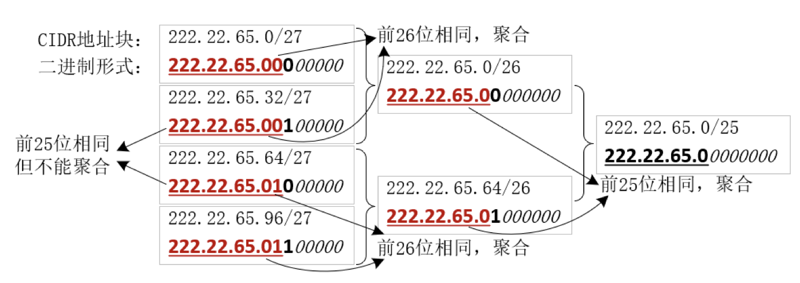

+ 在CIDR的应用中，有一种特殊的情况，**主机号全“0”和全“1”的IP地址可以使用**。

+ 当路由器之间被一条点到点链路连接，则每个端点都需要分配一个IP地址，且两台路由器之间的网络仅包含两个IP地址，为了节省IP地址，RFC3021建议将/31地址块中包含的两个地址分配给两台路由器。

+ 相应的，在IPv6中，对于这种特殊情况，RFC6164中也建议使用/127地址块。

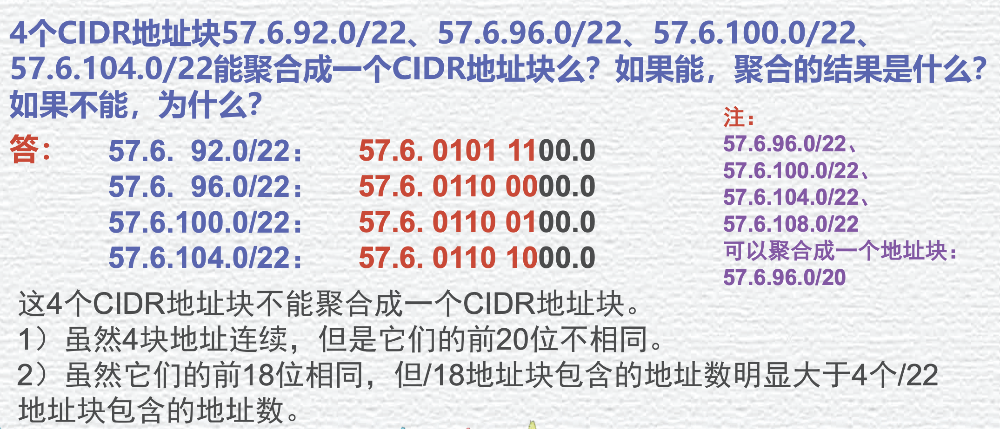

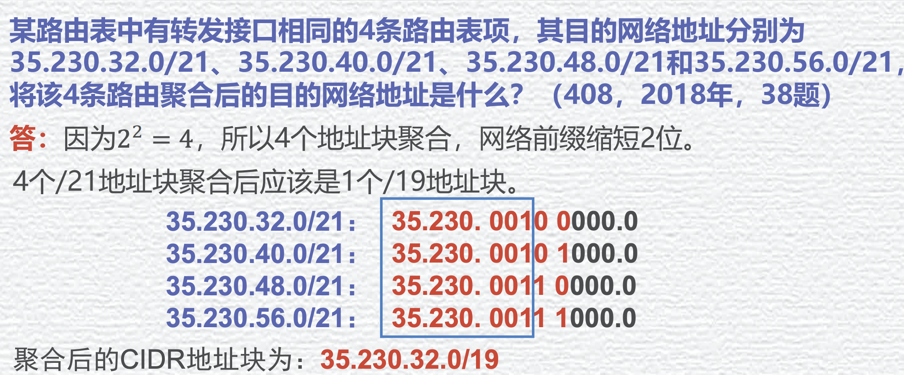

### 2.7 特殊用途的IP地址

+ 常见的特殊用途地址包括：

+ 专用网络地址

  ① 10.0.0.0~10.255.255.255（10.0.0.0/8）；

  ② 172.16.0.0~172.31.255.255（172.16.0.0/12）；

  ③ 192.168.0.0~192.168.255.255（192.168.0.0/16）。

+ “链路本地”地址
  169.254.0.0/16。

+ 运营商级NAT共享地址
  100.64.0.0/10

+ 用于文档的测试网络地址

  ① TEST-NET-1：192.0.2.0~192.0.2.255（192.0.2.0/24）；

  ② TEST-NET-2：198.51.100.0~198.51.100.255（198.51.100.0/24）；

  ③ TEST-NET-3：203.0.113.0~203.0.113.255（203.0.113.0/24）。

+ 回送测试地址
   127.0.0.0/8

+ 受限广播地址
  255.255.255.255/32

+ 本网络上的主机地址
  0.0.0.0/8

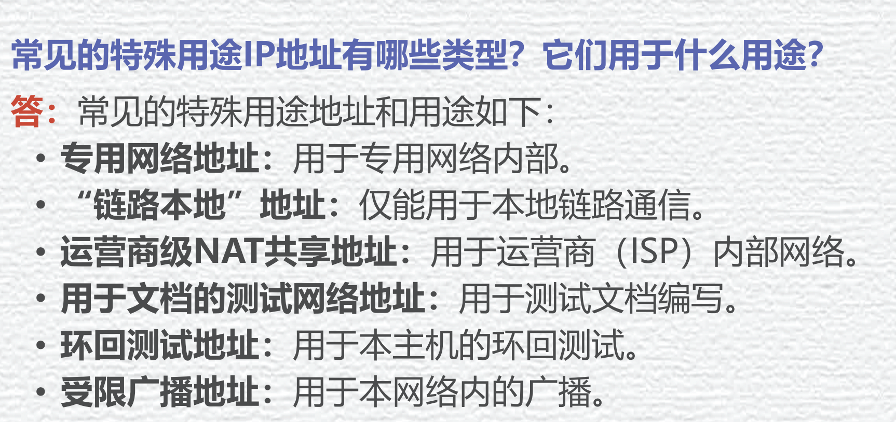

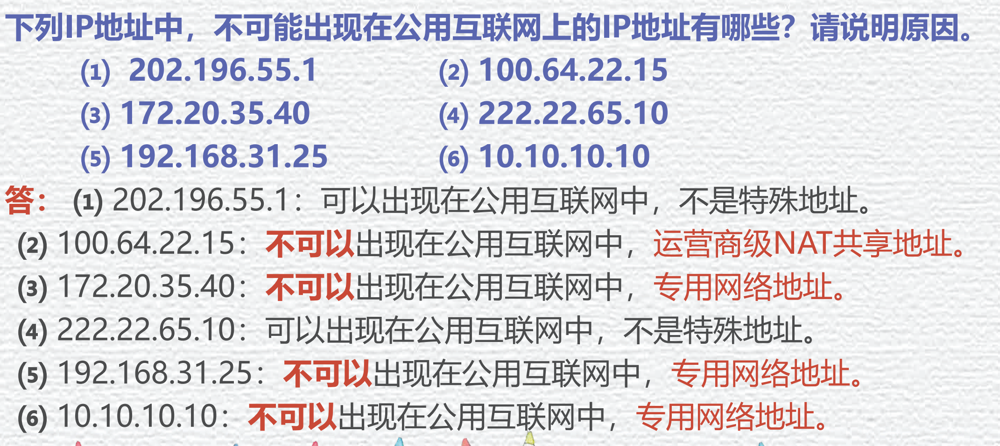

### 2.8 IP地址的规划和分配

## 第三章：应用层

cookie、HTTP1-持续连接、非持续连接

理解：DHCP自动配置-四个步骤，电子邮件组成

## 第四章：传输层

理解：运输层服务、每一个首部字段的含义，给了字段名，说出字段含义

停止等待协议比较重要，

TCP连接管理，三次握手四次握手需要会运用。以字节为单位的滑动窗口，里面的序号和确认号需要会计算。

不要求计算超时重传超时时间。

流量控制：一个公式

拥塞控制：发送窗口小于等于拥塞窗口

### 4.1 端口

+ 传输层复用是指将多种应用数据封装在同一种传输层协议数据单元中。
+ 传输层分用是指将封装在同一种传输层协议数据单元中的数据分发给不同的应用进程。
+ 实现传输层的复用和分用，需要一个标识符来标识不同的应用进程。
+ 在计算机的操作系统中，一般采用进程标识符来标识进程。但不同的操作系统，其进程标识符格式不尽相同。
+ 为了使不同操作系统上的进程能够互相通信，就必须选择与操作系统无关的、统一的标识符来标识通信中的进程。
+ 传输层协议使用端口号来标识应用进程，端口号也简称为端口。
+ TCP和UDP的首部中均包含源端口字段和目的端口字段，端口字段长度为16位，其取值范围在0~65535之间
+ 源端口字段用来标识发送方进程，目的端口字段用来标识接收方进程。
+ 在接收方进行处理时，源端口通常用作“返回地址”的一部分。
+ 传输层的端口仅具有本地意义，即它所标识的是本计算机中的应用进程。
+ 传输层利用端口实现复用和分用。

IANA将端口号分为三类：**系统端口**、**用户端口**和**动态端口**。

系统端口：

+ 也称为**熟知端口**
+ 取值范围：0~1023
+ 由IANA分配使用
+ 一般用于服务进程

用户端口：

+ 也称为**登记端口**
+ 取值范围：1024~49151
+ 向IANA申请使用
+ 一般用于服务进程

动态端口：

+ 也称为**私有端口**或**短暂端口**
+ 取值范围：49152~65535
+ 操作系统临时分配
+ 一般用于客户进程


### 4.2 UDP

#### 4.2.1 用户数据报协议概述

+ UDP提供传输层最小服务，包括复用分用功能和差错检测功能。
+ 主要特点：
  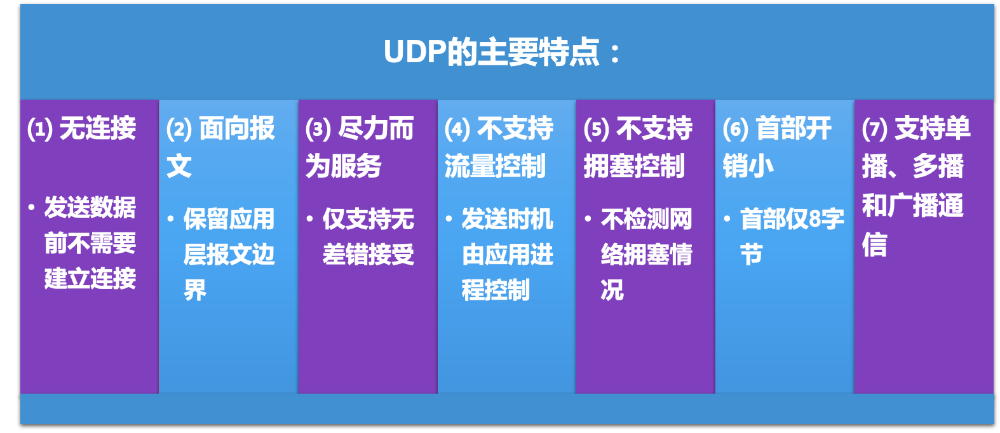
+ UDP保留应用层报文边界。将应用进程传递来的报文作为UDP的数据部分直接封装进UDP用户数据报。
+ UDP对应用层报文，既不拆分，也不合并，一次发送一个报文。
+ UDP报文的长度是由应用进程决定的。
+ 典型的UDP应用进程，将报文长度限制在512字节以内。如DNS、DHCP。

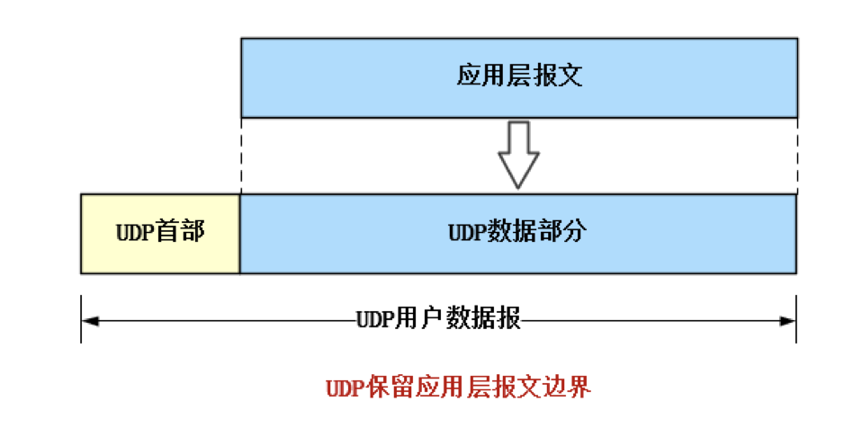

#### 4.2.2 UDP用户数据报格式

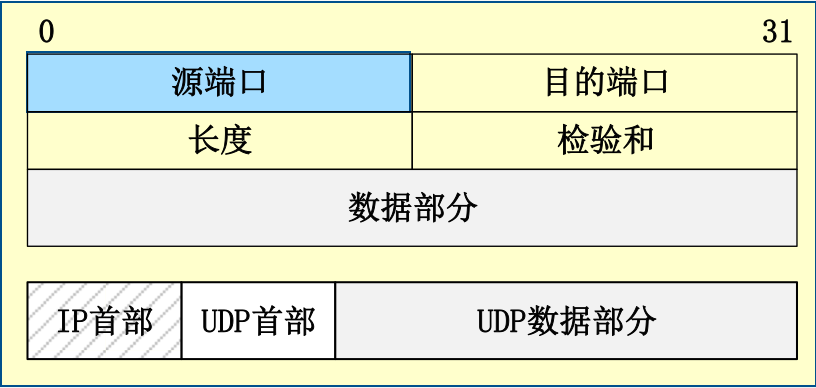

⑴ 源端口

+ 源端口是发送方的端口号，占16位。
+ 源端口号是可选的，如果UDP的发送方不需要对方回复，该字段允许置为全0。
+ UDP通信实例截获的用户数据报中，源端口值为0xc15e，即49502。该端口为短暂端口

⑵ 目的端口

+ 目的端口是接收方的端口号，占16位。
+ 接收方UDP向应用层交付报文时需要使用该字段。
+ UDP通信实例截获的用户数据报中， 目的端口值为0x1193，即4499。该端口为登记端口

⑶ 长度

+ 长度指UDP首部和UDP数据部分的总长度，占16位。
+ 长度的最小取值是8字节。
+ UDP通信实例截获的用户数据报中，长度字段的值为0x0013，即19。本例中，UDP数据部分长度11字节、UDP首部长度8字节。

⑷ 检验和

+ 检验和也称为校验和。 UDP检验和是一个端到端的检验和，占16位。
+ UDP检验和由初始发送方计算得到，由最终接收方进行检验，用于检验端到端的传输过程中，是否出现了比特差错。
+ 对于不能通过检验的用户数据报，UDP仅做丢弃处理。
+ UDP通信实例截获的用户数据报中，检验和字段的值为0x92be，检验通过。

#### 4.2.3 检验和

+ UDP检验和的计算范围覆盖UDP首部、UDP数据部分和一个伪首部。
+ 伪首部衍生自IP首部和UDP首部中的某些字段，共12字节长。
+ 伪首部并不是用户数据报真正的首部，只是在计算机检验和时，临时添加到UDP用户数据报前面，参加UDP检验和的计算。
+ 伪首部既不向下层传送，也不向上层提交，更不会被封装传输。
+ 在传输层的TCP协议中，TCP检验和的计算也采用了相似的伪首部。

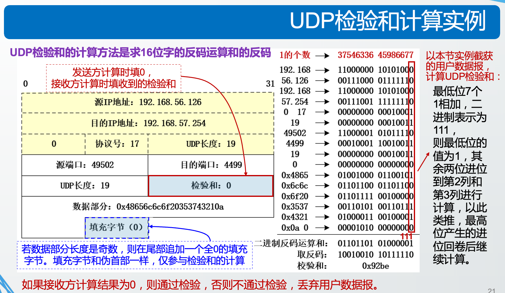

### 4.3 可靠传输原理

+ 所谓可靠传输服务是指为上层实体提供一条可靠的逻辑信道，通过该信道传输的数据，不会发生比特差错或者丢失，并且所有数据都按照其发送顺序进行交付。
+ 提供可靠传输服务的协议称为可靠传输协议。
+ 理想的可靠信道，满足以下两个假定：
  **⑴ 传输的数据不会产生比特差错、丢包或延迟；**
  **⑵ 接收方的接收速率能够与发送方的发送速率一样快。**

#### 4.3.1 停止等待协议

1. 除去假定（2）——无比特差错、丢包或延迟信道上的可靠传输

+ 去除理想信道的第⑵个假定，保留第⑴个假定，即信道是无比特差错、丢包或延迟的。
+ 为了保证接收方B能够正确的接收和处理收到的数据，需要增加流量控制机制：
+ 当B收到一个PDU，处理完毕，做好接收下一个PDU的准备时，B发送给A一个包含肯定应答（Acknowledgment）的 PDU，记为ACK。
+ A每次发送完一个PDU就必须停止发送，等待B发来的ACK。在收到ACK后，A才能够发送下一个PDU。
+ 这种具有流量控制的，每发一个PDU就停下来等待的协议称为停止等待协议，简称为停等协议，SW协议。
+ 仅具有流量控制功能的停等协议记为SW1.0协议。

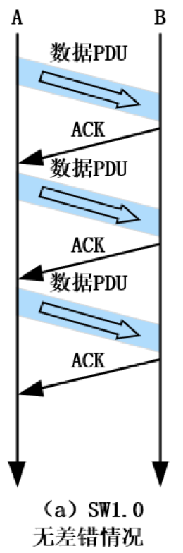

2. 除去假定（1）——有比特差错、丢包或延迟信道上的可靠传输

+ 分别考虑以下几种情况：
  + 数据PDU出错或丢失
  + ACK出错或丢失
  + ACK延迟

数据PDU出错或丢失：

+ B在接收PDU时，可以通过检验和计算等措施检测到差错。对于出错的PDU，B直接丢弃，不发送ACK。
+ 为发送方增加超时重传机制：A每发送一个PDU后，设定一个超时计时器，如果超时计时器到期仍然没有收到B发送的ACK，A就重传前面发过的PDU。
+ 如果超时计时器到期之前收到了B发送的ACK，则撤销超时计时器。
+ 显然，如果A发送的数据PDU在传输过程中丢失，B将收不到PDU，也就不会发送ACK，超时计时器到期后，A也会重发丢失的PDU。
+ 具有超时重传机制，不需要接收方的请求就能自动重传出错或丢失的PDU，这种协议称为自动重传请求ARQ协议

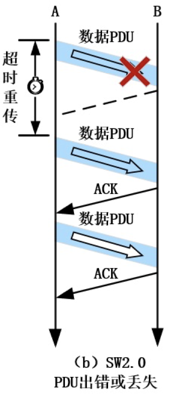

ACK出错或丢失：

+ 如果B发送给A的ACK在传输过程中出现差错或丢失，由于A收不到正确的ACK，当超时计时器到期后，A将重发前面发过的PDU。
+ 但是B曾经正确接收到该PDU，为了避免B将重复的PDU交给上层协议实体，在SW2.0基础上，为数据PDU增加序号字段，得到SW3.0协议。
+ A每发送一个PDU，将序号加1，写入新PDU的序号字段。
+ 超时重传的PDU与出错或丢失的PDU具有相同的序号。
+ B可以根据序号判断收到的PDU是否是重复的，如果是重复的PDU，说明B发给A的ACK没有正确送达，于是B丢弃重复的PDU，并重传ACK。

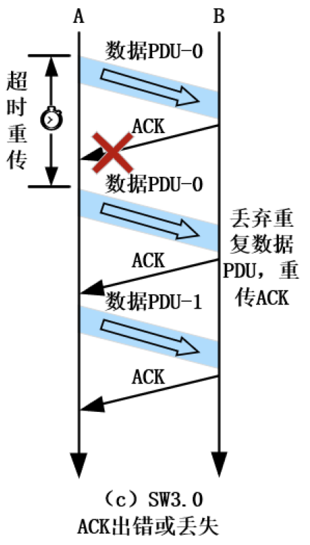

ACK延迟：

+ B发给A的ACK在信道中传输时，有可能会延迟到达A。
+ 如果A曾经重传过某个PDU，当迟到的ACK到达时，A不能判断该ACK对应哪一个数据PDU，SW3.0将失效。
+ 在SW3.0基础上，为ACK增加肯定应答号字段，得到SW4.0协议。
+ B每收到一个数据PDU，取出该PDU的序号，在发送ACK时，将序号写入ACK的肯定应答号字段，以此说明该ACK对应哪个数据PDU。
+ A可以根据肯定应答号判断收到的ACK是否重复，如果是重复的ACK，则A忽略该重复的ACK，不做任何其他处理。

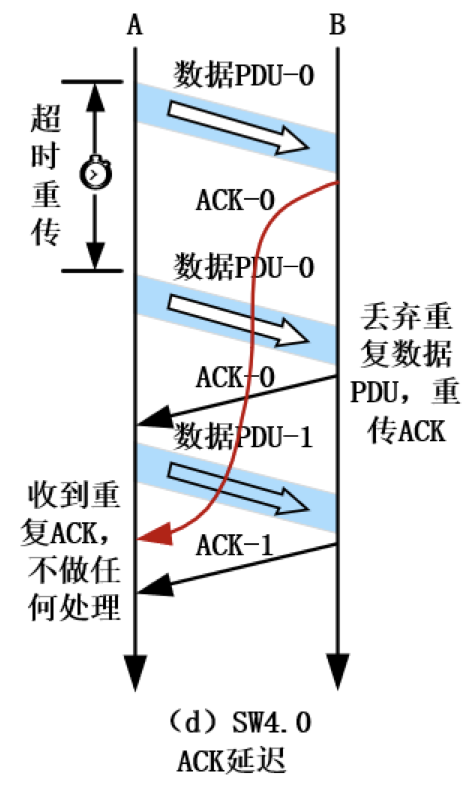

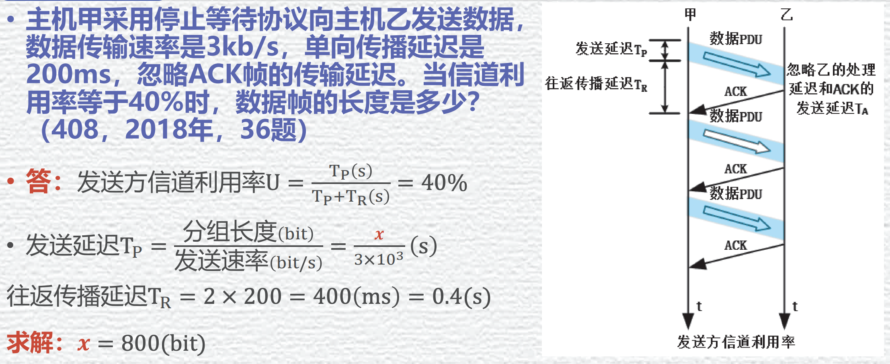

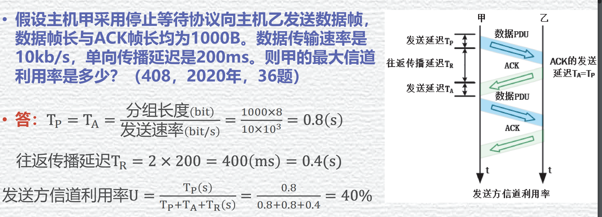

#### 4.3.2 连续ARQ协议

为了提高传输效率，可以采用流水线传输的方式。

流水线传输方式使信道上不断有数据在传送，可以获得较高的信道利用率。

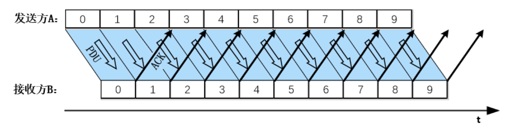

采用流水线传输方式的可靠传输协议称为连续ARQ协议，也称为滑动窗口协议

根据差错恢复方式的不同，连续ARQ协议分为两种：回退N步（GBN）的连续ARQ协议和选择重传（SR）的连续ARQ协议。

+ 执行滑动窗口协议的通信双方根据自己的缓存空间，各自维护一个窗口。
+ 发送方维持发送窗口swnd，接收方维持接收窗口rwnd。
+ 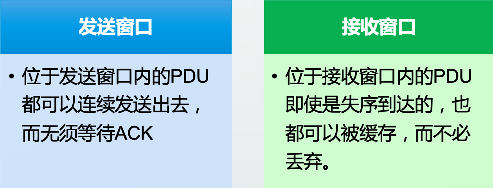

发送窗口：

+ 指针P<sub>1</sub>指向最早未收到ACK的PDU，

+ 指针P<sub>2</sub>指向下一个待发送的PDU，

+ 指针P<sub>3</sub>指向发送窗口外的第一个PDU。

+ [P<sub>1</sub>，P<sub>3</sub>-1] 区间称为发送窗口
+ **发送窗口长度**N=P<sub>3</sub>-P<sub>1</sub>，本例中，发送窗口长度为固定值10


+ 当发送方收到对PDU-3和PDU-4的ACK后，发送窗口将**向前滑动**，如图（b）所示。P<sub>1</sub>指针滑动后指向PDU-5。
+ 由于本例中窗口长度是固定值，所以P<sub>3</sub>指针也随之向前滑动，保持发送窗口长度值10不变。

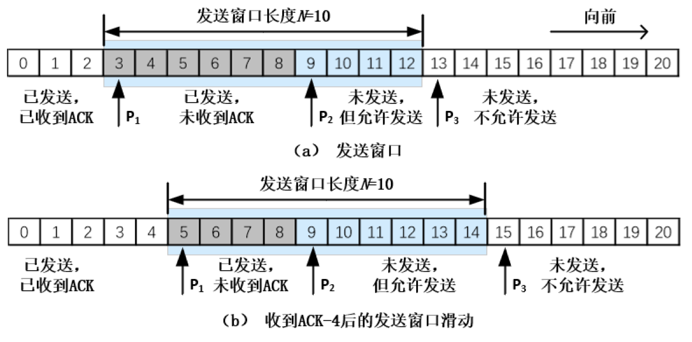

接收窗口：

+ 指针P<sub>4</sub>指向下一个待接收的PDU，
+ 指针P<sub>5</sub>指向接收窗口外的第一个PDU。
+ [P<sub>4</sub>，P<sub>5</sub>-1] 区间为接收窗口
+ **接收窗口长度**N′=P<sub>5</sub>-P<sub>4</sub>，在本例中，接收窗口长度为固定值10。

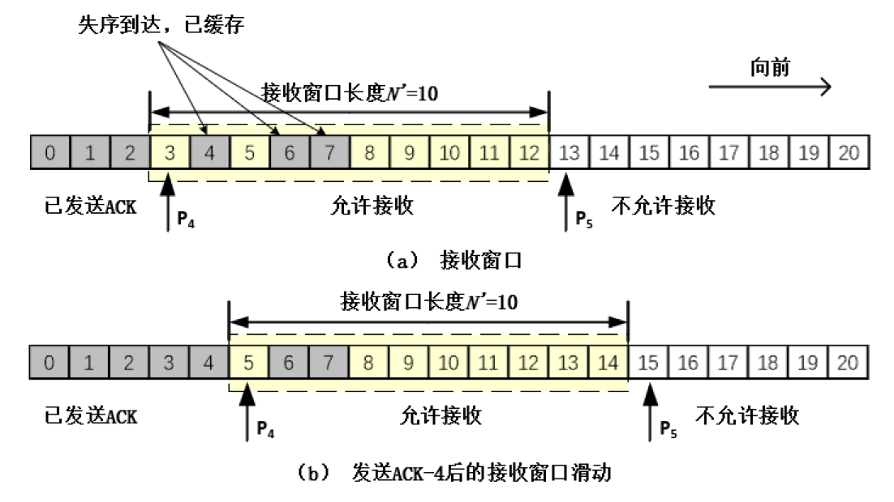

+ 当接收方收到PDU-3后，由于之前接收方已经缓存了PDU-4，接收方可以连续发送对PDU-3和PDU-4的ACK。
+ 发送ACK-4后，接收窗口将向前滑动，如图（b）所示。P4指针滑动后指向PDU-5，
+ 由于本例中窗口长度是固定值，所以P5指针也随之向前滑动，保持接收窗口长度值10不变


累积肯定应答：

+ 接收方允许采用累积肯定应答的方式发送ACK。
+ 累积肯定应答指接收方不必对收到的分组逐个发送ACK，而是在收到几个分组后，对按序到达的最后一个PDU发送ACK，该ACK表示到这个分组为止的所有分组都已经正确收到了。
+ 采用累积肯定应答后，ACK中的肯定应答号是最后一个按序到达的PDU的序号。

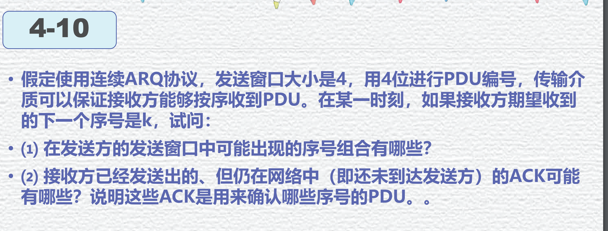

#### 4.3.3 GBN

+ 对比停等协议和滑动窗口协议的基本概念，不难发现，停等协议实质上是发送窗口长度为1，接收窗口长度也为1的滑动窗口协议。
+ GBN协议是发送窗口长度大于1，接收窗口长度等于1的滑动窗口协议
+ 我们观察一个发送窗口长度为4，接收窗口长度为1的GBN协议运行的例子

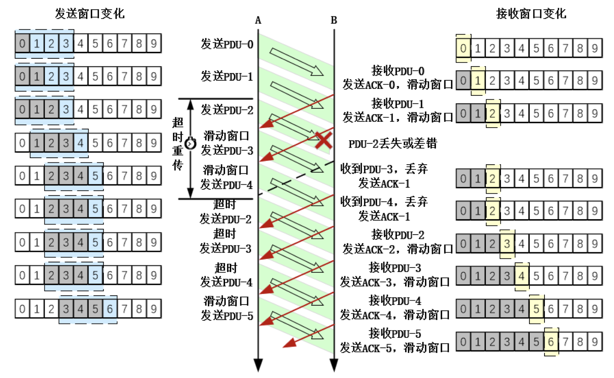

发送方：

① 若发送窗口未满，则用发送缓存中的数据组装一个PDU，发送出去，登记超时计时器；若发送窗口已满，则等待发送窗口滑动。

② 若收到ACK，则取消该ACK对应的PDU以及之前的PDU的超时计时器。然后根据ACK的肯定应答号和发送窗口长度，计算并滑动当前发送窗口。

③ 若检测到超时事件，则重传超时的PDU。

接收方：

① 若收到的PDU落在接收窗口内，则接收该PDU，发送对该PDU的ACK，并滑动接收窗口。

② 若收到的PDU未落在接收窗口内，则丢弃该PDU，发送对最后一个正确PDU的ACK。

信道利用率：

+ 观察GBN协议的运行过程，可以发现流水线方式的传输使信道中不断有数据在传送，确实可以提高信道利用率。
+ 但由于接收窗口仅为1，造成丢失或差错的PDU之后到达的所有PDU均被发送方重传，即使这些失序到达的PDU都是正确的。这种处理方式造成了信道资源的浪费。
+ 从发送方角度来看，一旦发生超时重传事件，则需要回退N步，从超时的PDU开始重新发送所有后续PDU。

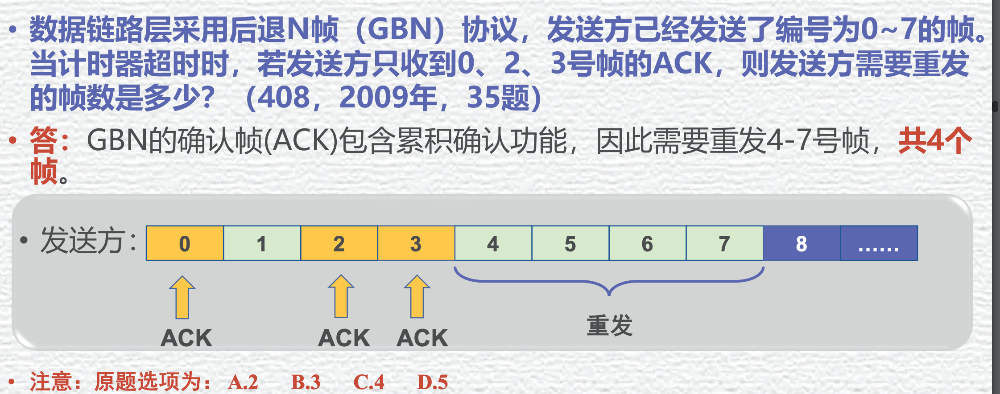

#### 4.3.4 SR

+ 停等协议是发送窗口长度为1，接收窗口长度也为1的滑动窗口协议。
+ GBN协议是发送窗口长度大于1，接收窗口长度等于1的滑动窗口协议。
+ SR协议是发送窗口长度大于1，接收窗口长度也大于1的滑动窗口协议。
+ SR协议中，接收方使用按序到达的最后一个PDU序号对所有按序到达的PDU进行累积肯定应答，同时使用选择肯定应答（Selective Acknowledgement，SACK）对失序到达的PDU单独进行肯定应答。
+ 选择肯定应答是SR协议必须具备的功能，累积肯定应答是SR协议的可选功能。
+ 我们观察一个发送窗口长度为4，接收窗口长度也为4的SR协议运行的例子。本实例同时使用了上述两种肯定应答。 

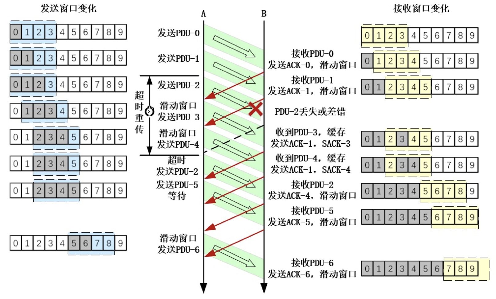

发送方：

① 若发送窗口未满，则用发送缓存中的数据组装一个PDU，发送出去，登记超时计时器；若发送窗口已满，则等待发送窗口滑动。

② 若收到ACK，则取消该ACK对应的PDU以及之前的PDU的超时计时器。然后根据ACK的肯定应答号和发送窗口长度，计算并滑动当前发送窗口。

③ 若收到SACK，则取消该SACK对应的PDU的超时计时器。

④ 若检测到超时事件，则重传超时的PDU。

接收方：

① 若收到的PDU落在接收窗口内，且该PDU是按序到达的PDU，则接收该PDU，对所有按序到达的正确PDU发送累积ACK，并滑动接收窗口。

② 若收到的PDU落在接收窗口内，但该PDU是失序到达的PDU，则缓存该PDU，发送对该PDU的SACK，并重新发送对最后一个正确PDU的累积ACK。

否定应答NAK：

+ 选择重传SR协议可以跟否定策略结合在一起使用，即当接收方检测到错误的PDU时，它就发送一个**否定**应答（Negative Acknowledgement，NAK）。
+ 在发送方，收到NAK可以触发该PDU的重传操作，而不需要等到对应的超时计时器超时，因此可以提高协议性能。

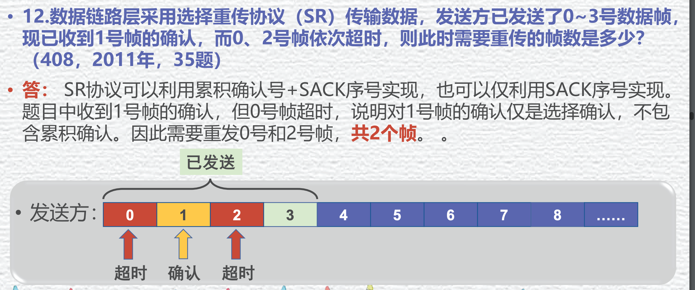

### 4.4 TCP

+ TCP的主要特点：
  ⑴ 面向连接: 通信之前需要先建立连接

  ⑵ 面向字节流: 把应用层交下来的数据看成无结构的字节流

  ⑶ 可靠交付: 保证无差错、不丢失、不重复，按序到达

  ⑷ 支持流量控制: 接收方控制发送方的发送速率

  ⑸ 支持拥塞控制: 根据网络拥塞情况，调整发送速率

  ⑹ 首部开销较大: 字段较多, 首部长度20~60字节

  ⑺ 仅支持一对一的单播通信

#### 4.4.1 TCP报文段格式

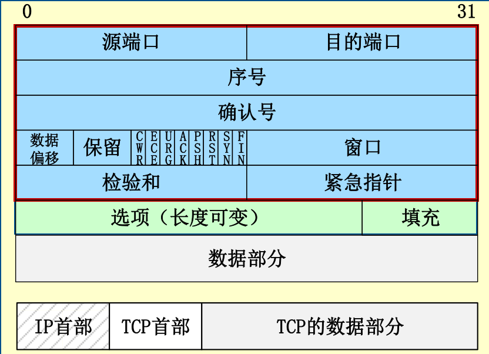

⑴ 源端口

源端口是发送方的端口号，占16位。

⑵ 目的端口

目的端口是接收方的端口号，占16位。

⑶ 序号

序号是本报文段中数据部分首字节的编号，占32位。

TCP在建立连接时，通信双方各自选择一个随机值作为初始序号。

⑷ 确认号

确认号是期待收到的对方下一个报文段中数据部分首字节的编号，占32位。

只有标志位ACK=1，确认号字段才有效。

TCP的确认号具有累积肯定应答功能。

⑸ 数据偏移

该字段的实际含义是TCP首部长度，占4位。

数据偏移以4字节（32比特）为单位，因此，TCP首部长度必须是4字节的整数倍。

数据偏移最大取值为15，因此TCP首部最大长度为60字节。

⑹ 保留

RFC793规定了6位作为保留位。

后来RFC3168将保留位的最低两位定义为显式拥塞通知的标志位。

目前，保留位共占4位。

保留位应置零。

+ URG：紧急数据标志。当URG=1时，紧急指针字段生效，表明报文段中包含紧急数据，紧急数据的位置由紧急指针字段指明。2011年RFC6093，建议不再使用紧急数据。
+ ACK：肯定应答标志。当ACK=1时，确认号字段生效，表明报文段中包含肯定应答信息。
  TCP规定，连接建立后的所有报文段都必须把ACK置1。
+ PSH：推送标志。当PSH=1时，表明发送方要求接收方尽快将报文段中的数据交付给上层。
  在包括Berkeley Socket在内的多数TCP/IP实现中，PSH标志置1代表发送方缓存中已经没有待发送数据。
  在处理telnet等交互模式的连接时，该标志总是置1的。
+ RST：重置连接。当RST=1时，表明TCP连接中出现了错误，需要取消连接。
  RST=1的报文段通常称为RST报文段。
+ SYN：同步连接。当SYN=1时，表明报文段是一个TCP建立连接请求。
  SYN=1的报文段通常称为SYN报文段。
+ FIN：终止连接。当FIN=1时，表明发送方的数据已经发送完毕，并请求释放TCP连接。
  FIN=1的报文段通常称为FIN报文段。

⑻ 窗口

窗口值代表接收窗口长度，用来进行流量控制，占16位。也称为通知窗口。

发送方根据通知窗口设置发送窗口长度。

发送窗口范围：

开始指针P1：接收方报文段中的确认号

结束指针P3：接收方报文段中的确认号+通知窗口

⑼ 检验和

TCP检验和与UDP检验和类似，也是端到端的检验和，占16位。

TCP检验和的计算也需要覆盖12字节的伪首部，伪首部的格式与UDP伪首部的格式一致。

TCP检验和的计算方法与UDP检验和的计算方法一样。

⑽ 紧急指针

当标志位URG置1时，紧急指针指出本报文段中紧急数据的位置，占2字节。

RFC6093规定，本报文段的序号值加紧急指针值等于紧急数据后的首字节的编号。

RFC6093建议，利用TCP通信的新应用，不再使用紧急指针。

| 选项名称                                        | 类型 | 长度 | 参考RFC                |
| ----------------------------------------------- | ---- | ---- | ---------------------- |
| 选项列表结束（End of Option List，EOL）         | 0    | 1    | RFC793                 |
| 无操作（No Operation，NOP）                     | 1    | 1    | RFC793                 |
| 最大报文段长度（Maximum Segment Size，MSS）     | 2    | 4    | RFC793/RFC1122/RFC6691 |
| 窗口扩大（Window Scale，WS）                    | 3    | 3    | RFC7323                |
| 允许SACK（SACK-Permitted，SACK-P）              | 4    | 2    | RFC2018                |
| 选择肯定应答（Selective Acknowledgement，SACK） | 5    | 可变 | RFC2018                |
| 时间戳（Timestamps，TS）                        | 8    | 10   | RFC7323                |

+ NOP（无操作NOP选项）：
  NOP选项可以用在TCP选项之间或者结尾处，用来保证TCP选项的总长度满足4字节对齐。
  在多数TCP/IP实现中，通过添加一个或多个NOP选项的方法来实现TCP选项的4字节对齐，因此不需要添加EOL选项。。

+ MSS（最大报文段长度MSS选项）:
  MSS值指TCP报文段中数据部分的最大长度，不包含TCP首部。
  MSS选项用来限制TCP通信中对方在发送数据时能够使用的最大报文段。
  RFC1122规定，TCP应该在SYN报文段中使用MSS选项。
  MSS值的设置与接收方的缓存以及接收窗口长度都没有关系，而是出于对传输效率的考虑。过小的MSS值和过大的MSS值都会影响通信效率。

  MSS值过小：

  即TCP报文段中的数据部分很小，加上TCP首部（20~60字节长度）和IP首部（20~60字节长度）后，才能在网络中传送。

  由于数据部分比例小，网络利用率很低。

  MSS值过大：

  TCP报文段的数据部分加上TCP首部和IP首部后，构成的IP数据报过长，需要进行IP分片，才能在网络中传送。

  IP分片和重组的开销，造成效率下降。
  $$
  IP首部长度=IP固定首部长度（20字节）+IP选项长度（0−40字节）
  $$

  $$
  TCP首部长度=TCP固定首部长度（20字节）+TCP选项长度（0−40字节）
  $$

  $$
  MSS=MTU−IP首部长度− TCP首部长度
  $$

  

发送方有效最大报文段长度的计算：

TCP发送方在封装报文段时，需要计算有效最大报文段长度EMSS。

EMSS受到对方发来的RMSS的限制，也受到发送方自己的MTU值、TCP选项长度以及IP选项长度的限制。

由于历史原因，RFC1122规定EMSS的计算公式比较复杂。

将RFC1122规定的EMSS的计算公式，做一个简单的变换，可以得到：
$$
EMSS=min ⁡(RMTU,SMTU )−TCP首部长度−IP首部长度
$$
在TCP的具体实现中，有效最大报文段长度EMSS的计算还需要考虑路径MTU（PMTU）的限制。PMTU指整个网络路径上的所有链路中最小的MTU。

TCP发送方发送数据时，为提高传输效率，会尽可能按照EMSS值封装TCP报文段，按照EMSS值封装的报文段称为全长报文段（Full-sized Segment）。

+ WS：（窗口扩大WS选项）
  TCP首部中，窗口字段占16位，窗口最大值65535。
  延迟带宽积很大的网络称为长肥网络，运行在长肥网络上的TCP连接称为长肥管道。卫星信道上的TCP连接就是典型的长肥管道。
  长肥管道中，仅16位的窗口字段会造成发送的所有的数据都还未到达接收方，但是发送方由于发送窗口已满而不能继续发送，从而降低了网络吞吐量
  RFC7323中定义了窗口扩大WS选项，用以解决该问题。
  

  移位值S将窗口位数从16位增大到(16+S)位。最大移位值是14，相当于将窗口值增大到30位。

  扩大后的窗口值按以下公式进行计算：
  $$
  扩大后的窗口值=窗口值×2^S
  $$
  窗口扩大选项只允许出现在SYN报文段中，为使用窗口扩大功能，通信双方需要在SYN报文段中包含该选项。

  TCP连接建立后，移位值是与方向绑定的，两个方向的移位值可以不同。

#### 4.4.2 TCP的连接管理

TCP的连接建立：

主动建立连接的一端称为客户，被动等待连接建立的一端称为服务器。
TCP建立连接的过程中需要在客户和服务器之间进行三次报文段交换，称为三次握手或三报文握手。
首先，服务器进程B被动打开连接，从CLOSED状态进入LISTEN状态，等待来自客户的建立连接请求。

第一次握手：

客户进程A将SYN标志置1，选择初始序号ISN(A)，以服务器B的IP地址和端口号作为参数，构造TCP报文段，发送给B。

该报文段称为SYN报文段。

虽然SYN报文段的数据部分长度为0，但是占用1字节编号，以方便服务器对SYN请求进行肯定应答。

客户从CLOSED的状态进入SYN-SENT状态。


第二次握手：

收到客户A的SYN报文段后，服务器进程B发送自己的SYN报文段作为响应。

报文段中，将SYN标志置1，选择初始序号ISN(B)；并将ACK标志置1，将ISN(A)+1作为确认号。

该报文段称为SYN-ACK报文段。

SYN-ACK报文段也占用1字节编号。以方便客户对该SYN请求进行肯定应答。

服务器从LISTEN状态进入SYN-RCVD状态。

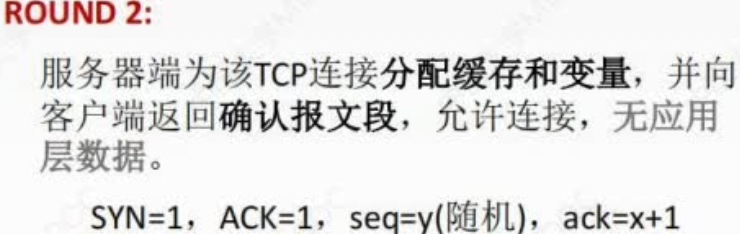

第三次握手：

收到服务器B的SYN-ACK报文段后，客户进程A发送ACK报文段。

报文段中，将ACK标志置1，将ISN(B)+1作为确认号。序号字段为ISN(A)+1。

该报文段称为ACK报文段。

ACK报文段可以携带数据，也可以不携带数据。如果不携带数据，则不占用序号，客户A随后发送的数据报文段中序号字段任然是ISN(A)+1。

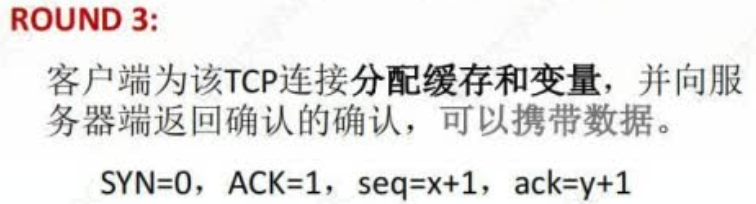

连接建立：

发完ACK后，客户A从SYN-SENT状态进入ESTABLISHED状态。

此时，对于客户进程A，TCP连接已经建立，可以开始进行数据传输了。

服务器B收到客户A的ACK报文段后，从SYN-RCVD状态进入ESTABLISHED状态。

此时，服务器进程B也可以开始进行数据传输了。

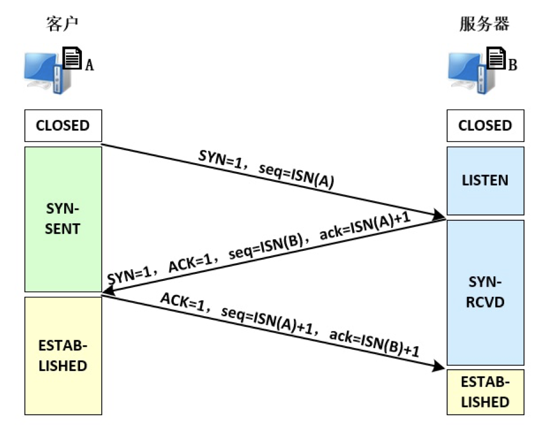

TCP的连接释放：

数据传输结束后，通信双方都可以主动释放TCP连接。
主动释放连接的一端称为客户，被动释放连接的一端称为服务器。
TCP释放连接的过程中需要在客户和服务器之间进行四次报文段交换，称为四次握手或四报文握手。
假定进程A主动释放连接。
将数据传输过程中，进程A发送给进程B的最后一字节编号记为x-1，进程B发送给进程A的最后一字节编号记为y-1。

第一次握手：

A向B发送释放连接请求报文段。

在该报文段内，将FIN标志置1，填写序号为x。

由于TCP建议连接建立后的所有报文段中ACK标志都置1，所以A也将ACK标志置1，并填写确认号为y，用以肯定应答收到的最后一字节数据。

该报文段一般称为FIN报文段。

FIN报文段数据部分长度为0，但是占用1字节编号，以方便通信中对方对FIN请求进行肯定应答。

客户从ESTABLISHED状态进入FIN-WAIN-1状态。

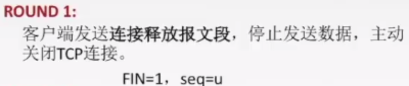

第二次握手：

收到A的释放连接请求后，服务器进程B应立即发送ACK。

在ACK报文段中，B将ACK标志置1，填写确认号为x+1，填写序号为y。如果该ACK不含数据，则不占用字节编号。

服务器从ESTABLISHED状态进入CLOSE-WAIN状态。

客户收到ACK报文段后，从FIN-WAIT-1状态进入FIN-WAIT-2状态

这时的TCP连接处于半关闭状态，

A不能再发送数据。B如果有数据，还可以继续发送，A仍然要接收。


第三次握手：

左图示例中，半关闭状态下，B没有发送数据。

当进程B需要释放连接时，也需要发送一个FIN请求。

该报文段中，FIN标志置1，序号仍然为y。B也将ACK标志置1，确认号仍然为x+1。

FIN报文段虽然不包含数据，但占用1字节编号，

服务器从CLOSE-WAIT状态进入LAST-ACK状态。

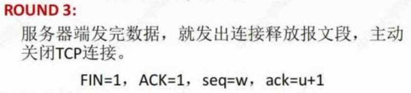

第四次握手：

收到B的FIN请求后，客户进程A应立即发送ACK。

在ACK报文段中，A将ACK标志置1，填写确认号为y+1，填写序号为x+1。

客户A发送了ACK报文段后，从FIN-WAIT-2状态进入TIME-WAIT状态。

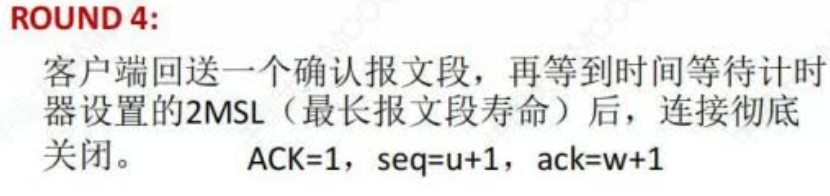

连接释放：

服务器进程B收到最后一个ACK报文后，从LAST-ACK状态进入COLOSED状态。此时，对于B来说，TCP连接已关闭。

客户进程A需要在TIME-WAIT状态等待2MSL时间之后，才能进入COLOSED状态。

MSL代表最长报文段生存期，RFC793建议MSL取值2分钟。

当2MSL计时器超时后，A从TIME-WAIT状态进入CLOSED状态。对于A来说，TCP连接才关闭。

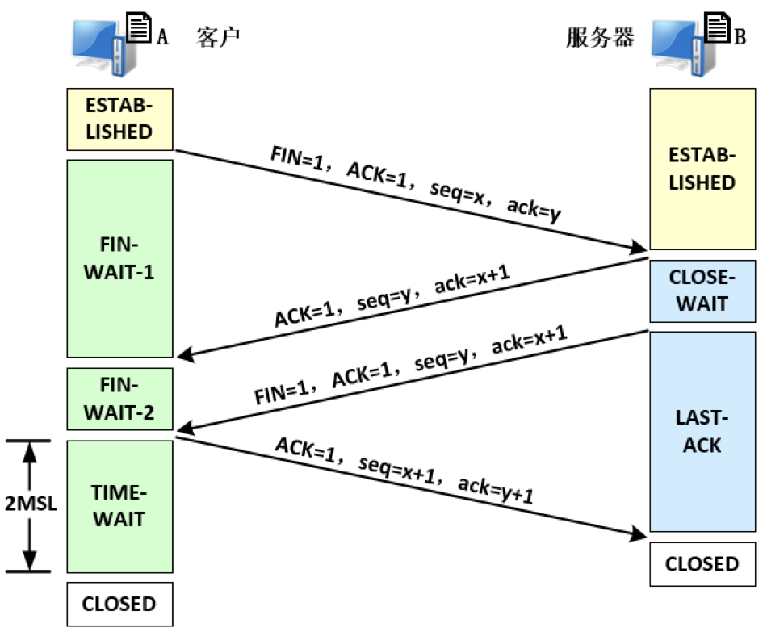

TCP的状态变迁：

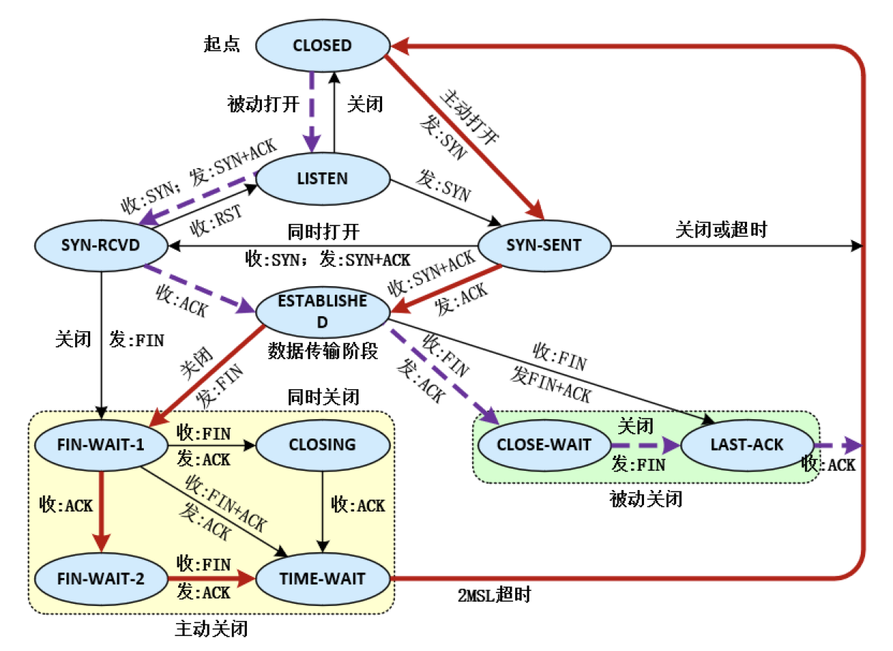


**三报文握手建立连接：**

客户（主动打开）：CLOSED → SYN-SENT → ESTABLISHED

服务器（被动打开）：CLOSED → LISTEN → SYN-RCVD → ESTABLISHED

**四报文握手释放连接：**

客户（主动关闭）：ESTABISHED → FIN-WAIT-1 → FIN-WAIT-2 → TIME-WAIT → CLOSED

服务器（被动关闭）：ESTABLISHED → CLOSE-WAIT → LAST-ACK → CLOSED

**三报文握手释放连接：**

客户（主动关闭）：ESTABISHED → FIN-WAIT-1 → TIME-WAIT → CLOSED

服务器（被动关闭）：ESTABLISHED → LAST-ACK → CLOSED

**同时打开：**

客户（服务器）：CLOSED → SYN-SENT → SYN-RCVD → ESTABLISHED

**同时**关闭：

客户（服务器）：ESTABLISHED → FIN-WAIT-1 → CLOSING → TIME-WAIT → CLOSED

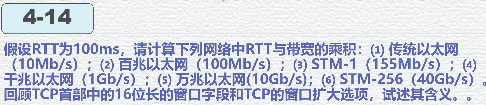

### 4.5 TCP的可靠传输

TCP的可靠传输协议是以字节为单位的滑动窗口协议。

TCP可靠传输的**特点**：

1.TCP窗口内的序号不是以PDU为单位编号，而是以字节为单位编号。

2.TCP的发送窗口和接收窗口均大于1。

3.TCP的发送窗口和接收窗口长度不是固定的，而是动态变化的。

4.TCP支持多种重传机制：超时重传、快重传和SACK重传。

#### 4.5.1 超时重传

如果出现了报文段丢失或差错，TCP将会采用超时重传机制，对超时且未收到ACK的报文段进行自动重传。

TCP的超时重传采用累积肯定应答，不能单独对失序到达的报文段进行肯定应答。

TCP的超时重传概念很简单，但实践中超时重传时间（RTO）的选择却比较复杂。

TCP测量往返路程时间（RTT），计算平滑往返时间，并计算超时重传时间（RTO）。

SRTT计算：

TCP记录一个报文段的发出时间，以及收到对应ACK的时间，二者之差作为一个RTT测量值，也称为RTT样本，记作RTT<sub>sam</sub>。

TCP维护一个RTT的加权平均值，称为平滑往返时间，记作SRTT。

每进行一次测量，TCP按照如下公式计算新的平滑往返时间：
$$
𝐒𝐑𝐓𝐓=(𝟏−𝜶)∙𝐒𝐑𝐓𝐓+𝛂∙𝑹𝑻𝑻𝒔𝒂𝒎
$$
RFC6298中，建议 α 取值0.125。

SRTT的初值应设置为第一个有效的RTT样本。

类似SRTT这种加权平均值称为指数移动加权平均值，时间越靠近当前时刻的数据权重越大。

RTTV的计算：

RFC6298定义了RTT偏差，记作RTTV，用以估算RTT样本偏离SRTT的程度。

RTT偏差也是一个指数移动加权平均值，每取得一次RTTsam，TCP按照如下公式计算RTTV：
$$
𝐑𝐓𝐓𝐕=(𝟏−𝜷)∙𝐑𝐓𝐓𝐕+𝛃∙|𝐒𝐑𝐓𝐓−𝑹𝑻𝑻𝒔𝒂𝒎|
$$
RFC6298中，建议 β 取值0.25。

RTTV的初值设置为第一个RTT样本值的一半。

RTO的计算：

超时重传时间RTO应略大于平滑往返时间SRTT。

每取得一次RTTsam，TCP计算SRTT和RTTV，然后按照如下公式计算RTO：
$$
𝐑𝐓𝐎=𝐒𝐑𝐓𝐓+𝒎𝒂𝒙⁡(𝐆,𝟒×𝑹𝑻𝑻𝑽)
$$
上式中G代表系统的时钟粒度（clock granularity），即使计算得到的RTTV趋近零，RTO也应该比SRTT大1个时钟粒度。在Linux系统中，TCP时钟粒度为1ms，因此RTO至少比SRTT大1ms。

RFC6298建议给RTO设定上界和下界，上界的建议值是60秒，下界的建议值是1秒。

在尚未取得有效RTT样本之前，RFC6298建议将RTO初值设置为1秒。

#### 4.5.2 快重传

快重传机制不依赖重传计时器超时，而是基于接收方的反馈信息来引发重传。

快重传机制通过检测重复ACK（duplicate ACK）事件发现丢包，触发重传。

由于TCP的确认号具有累积肯定应答功能，因此，当接收方TCP收到失序的报文段时，发送的ACK中的确认号，与确认最后一个按序到达的报文段的确认号一样。这种再次确认某个报文段的ACK称为重复ACK。

接收方发送ACK的策略：

对于正常到达的数据报文段，最多延迟500ms就需要发送ACK；连续收到两个正常数据报文段时，必须立即发送ACK。

对于失序到达的数据报文段，必须立即发送ACK（重复ACK）。

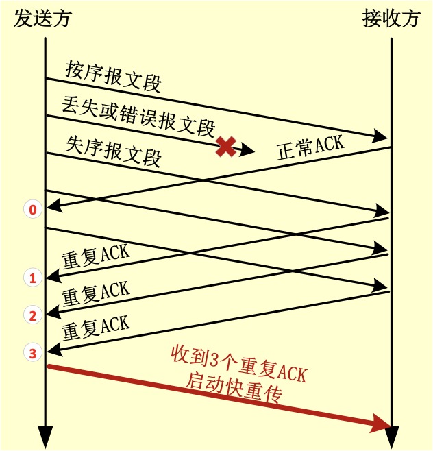

由于网络层不保证按序提交数据报，因此TCP发送方仅收到一个重复ACK，并不能确认是发生了丢包还是发生了失序传输。

RFC5681规定重复ACK的阈值（DupThresh）默认为3。注意：重复ACK的阈值是允许调整的。

当收到3个重复的ACK，才认为这个已经被确认4次（1次正常的确认 + 3次重复的确认）的报文段之后的报文段已经丢失。

当TCP发送方收到3个重复ACK时，TCP就启动快重传，立即重传丢失的报文段而不必等待重传计时器超时。

启动快重传时，发送方已经发送过的最大字节编号称为恢复点。

快重传机制属于选择重传协议，启动快重传后，在收到有效ACK前，TCP只能重传一个报文段。

有效ACK是指确认了新到达数据的ACK。有效ACK包括两种：完全ACK和部分ACK，这两种有效ACK的区分依赖恢复点的定义。

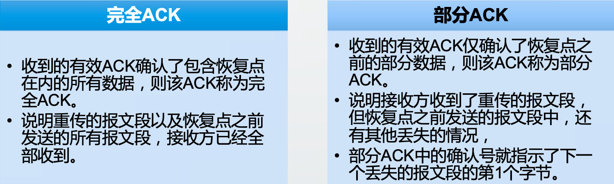

TCP NEWReno版本的快重传算法的要点可以总结如下：

① 收到3个重复ACK：记录恢复点，启动快重传算法，重传丢失的报文段；

② 收到部分ACK：立即重传下一个丢失的报文段；

 收到完全ACK：退出快重传。


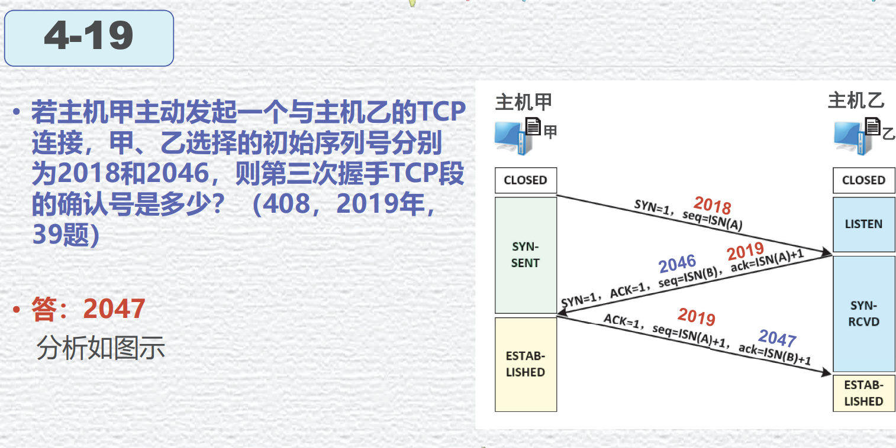

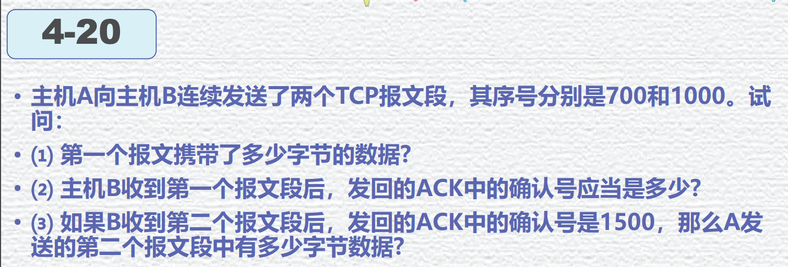

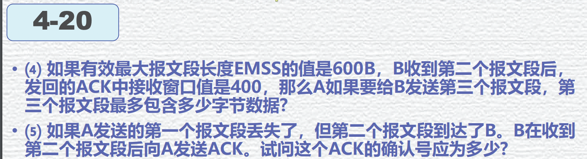

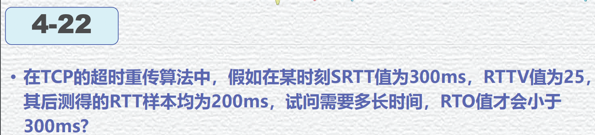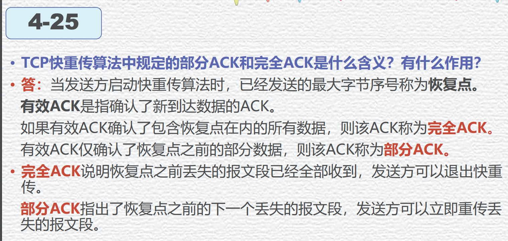

### 4.6 TCP流量控制

如果接收方应用进程读取数据的速度相对缓慢，而发送方发送数据太多、太快，发送的数据就可能会造成接收缓存溢出。

TCP的流量控制机制完成了对发送速度的调节，它是基于ACK报文段中的通知窗口长度来实现的。这种方式提供了明确的来自接收方的状态信息，可以避免接收方缓存溢出。

停等协议和连续ARQ协议，两者都采用了固定长度的发送窗口，不能根据接收方的情况进行调节。

TCP协议采用了可变长度的发送窗口，其发送窗口根据接收方的通知窗口设定。

### 4.7 TCP的拥塞控制

#### 4.7.1 慢开始

每收到一个有效ACK，把拥塞窗口增加不超过1 SMSS的数值。

RFC5681规定的计算公式如下：
$$
𝐜𝐰𝐧𝐝 +=𝐦𝐢𝐧⁡(𝐍，𝐒𝐌𝐒𝐒)
$$
其中N代表被刚收到的ACK确认的字节数。

显然，当N<SMSS时，每收到一个ACK，cwnd的增加量要小于SMSS。

大多数情况下，TCP发送的报文段是全长报文段，此时，每收到一个ACK cwnd增加1 SMSS。

从TCP发送一轮报文段到TCP收到这些报文段的ACK为止，经历的时间大约等于一个RTT，我们将之称为一个传输轮次。

使用传输轮次这个术语，更便于我们描述TCP的拥塞控制算法。

在慢开始阶段，拥塞窗口cwnd随轮次呈指数增长，每经过一个传输轮次，cwnd加倍。

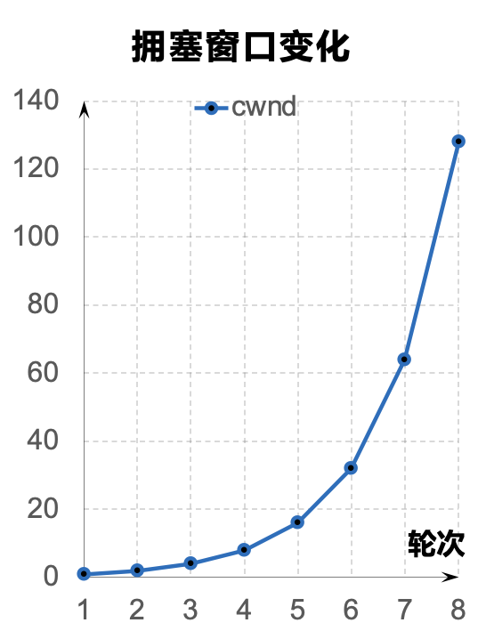

什么时候结束这种指数增长呢？慢开始算法提供了以下几种策略：

拥塞窗口增长超出慢开始阈值ssthresh

监测到重传事件时

TCP维持一个状态变量叫慢开始阈值ssthresh，也译作慢开始门限。

当cwnd<ssthresh时，TCP采用慢开始算法；

当cwnd>ssthresh时，TCP停用慢开始算法，改用拥塞避免算法；

当cwnd=ssthresh时，TCP选用慢开始算法或者拥塞避免算法。

ssthresh的初值应设置得尽可能高，然后ssthresh值随拥塞控制而调整。
$$
𝐬𝐬𝐭𝐡𝐫𝐞𝐬𝐡=𝐦𝐚𝐱⁡(𝐜𝐰𝐧𝐝/𝟐, 𝟐×𝐒𝐌𝐒𝐒)
$$
然后，将cwnd设为1，重新执行慢开始算法。

#### 4.7.2 拥塞避免

**每经过一个轮次，**cwnd**增加**1**SMSS**。

在拥塞避免阶段，拥塞窗口cwnd随轮次呈线性增长。

如果采用延迟ACK，那么拥塞避免阶段cwnd的增长速度将放缓。但仍然呈线性增长。

出现超时事件，则设置ssthresh = cwnd/2，然后设置cwnd = 1，重新执行慢开始。

出现快重传或SACK重传事件，执行快恢复算法

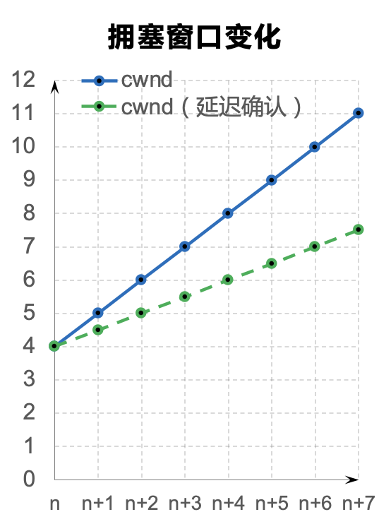

#### 4.7.3 快恢复

当监测到3个重复ACK或收到的SACK满足RFC6675的两个条件之一时，TCP启动快重传或SACK重传，同时启动快恢复。

RFC规定：快恢复算法与快重传算法一起实现。

RFC5681规定了TCP Reno版本的快重传和快恢复算法。

RFC6582规定了TCP NewReno版本的快重传和快恢复算法。

RFC6675规定了启用SACK支持后的快重传和快恢复算法。

三个版本的快恢复算法在经过快恢复阶段的调整之后，当退出快恢复算法时，cwnd值和ssthresh值均为启动快恢复算法时的cwnd值的一半。

退出快恢复算法后，TCP启动拥塞避免算法。

注意：在TCP快恢复算法执行过程中，如果监测到超时重传事件，TCP将退出快恢复算法，将cwnd设为1 SMSS，重新执行慢开始算法。

+ 状态变迁图：

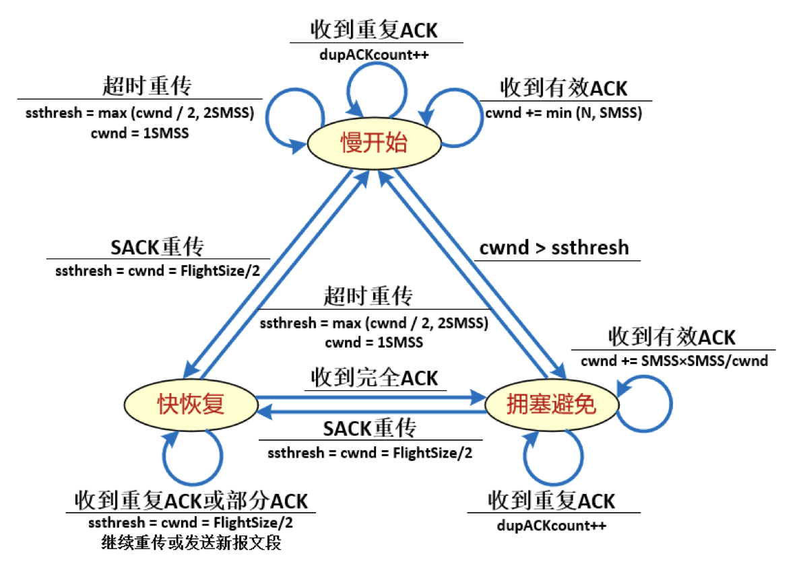

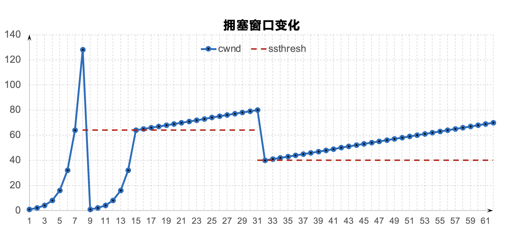

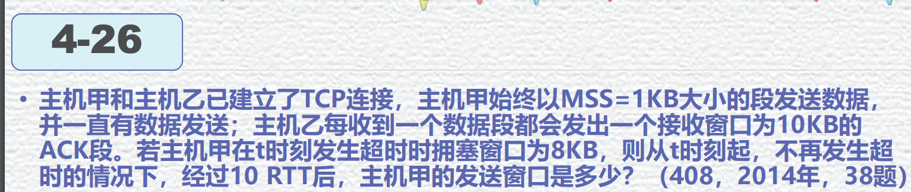

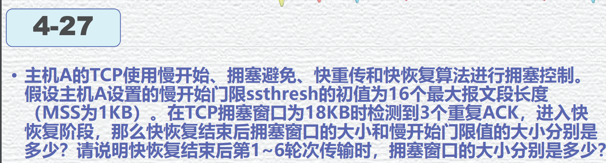

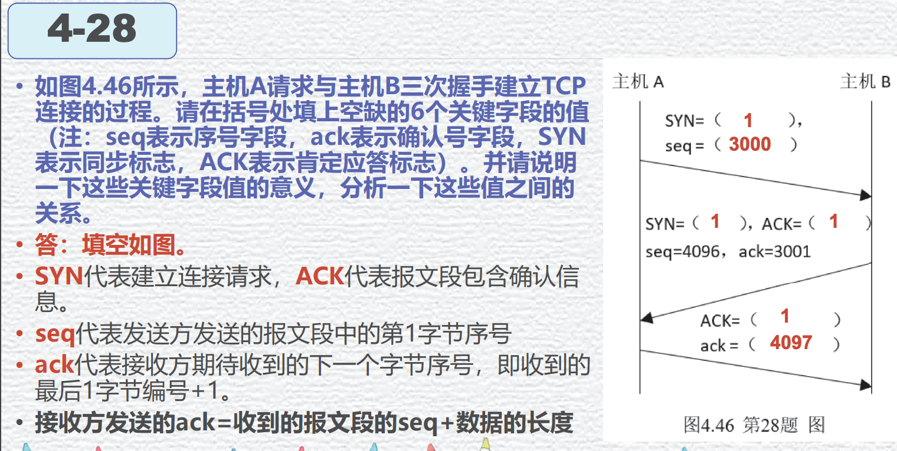

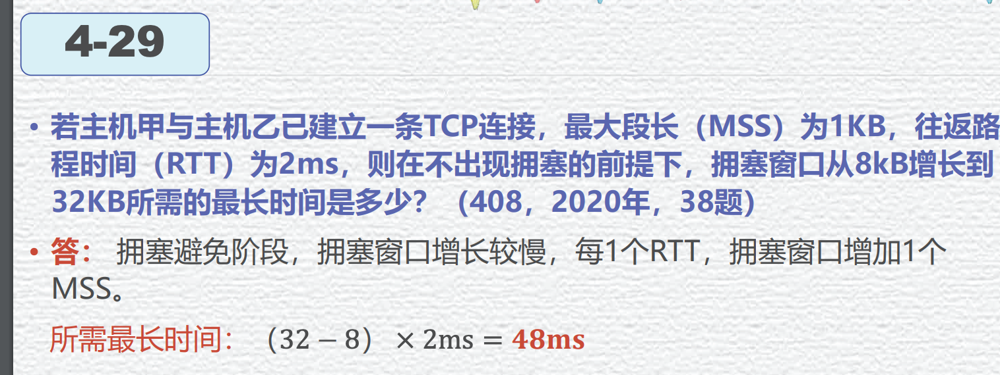

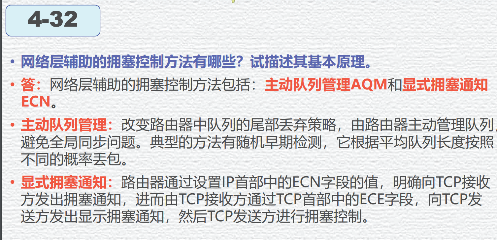

## 第五章：网络层

MPLS不考

网络层用处

IP首部的计算-分片的计算（分成几片，片偏移）

IP分组转发（作业上），最长前缀匹配算法，路由表

ICMP差错差错报告报文

ICMP应用理解，说清楚ping什么的怎么实现的。

RIP更新算法｜必须会

三个协议主要的区别

计算只要求RIP

NAT四个卷子都有，1.怎么转换数据（公网-专网）2.静态/动态NAT，什么时候满足


主要协议：

互联网协议（IP）：网络层核心协议。传输层TCP、UDP等协议的数据都通过IP数据报传输。

互联网控制报文协议（ICMP）：提供与网络配置信息和IP数据报处置相关的诊断和控制信息。

路由协议：路由器之间用来交换路由信息、链路状态信息或网络拓扑信息的协议，主要包括路由信息协议（RIP）、开放最短通路优先（OSPF）协议和边界网关协议（BGP）。

多协议标记交换（MPLS）：为IP等网络层协议提供面向连接的服务质量，支持流量工程、负载均衡，支持MPLS VPN等，在运营商和ISP中得到广泛应用。

相关协议地址解析协议ARP，在第6章中介绍。

### 5.1 控制平面与数据平面

+ 路由器是一种具有多个接口的专用计算机，每个接口连接了不同的网络。**路由器能够连接异构的网络**。
+ 路由器的主要功能包括**分组转发**和**路由选择**，其中分组转发功能属于数据平面，路由选择功能属于控制平面。
+ 传统网络中，每台路由器都由实现路由选择功能的控制平面和实现分组转发功能的数据平面构成。
+ 软件定义网络（SDN）通过将控制平面和数据平面分离，构建可编程控制的网络体系结构。
  + SDN的网络交换设备仅需实现数据平面的功能，控制平面的功能集中在远程控制器上实现。
  + 为区别于传统路由器，SDN将受控网络交换设备称为SDN网元或SDN交换机。
  + SDN的控制平面是集中式实现的。SDN的控制逻辑全部在SDN控制器中实现，SDN控制器通过控制数据平面接口CDPI对SDN交换机进行控制和管理。
  + SDN控制器维护流表，并通过OpenFlow协议将流表下发给SDN交换机。
  + SDN控制器通过北向接口向网络控制应用程序开放编程能力。
  + SDN的数据平面采用通用转发策略，即基于流表的转发策略。流表的匹配域是首部字段的集合。 SDN的转发策略能够匹配协议栈中的多个首部字段。

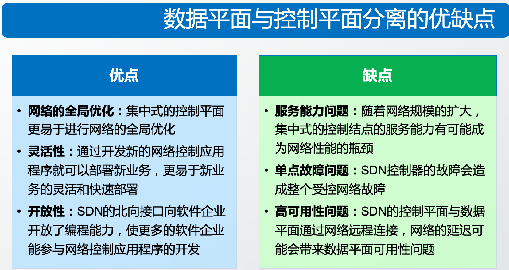

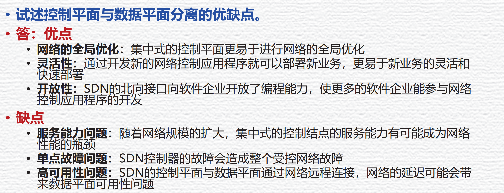

### 5.2 Internet Protocol (IP)

+ 源主机H1产生的IP数据报，经过多个路由器的转发，最终到达目的主机H2。
+ IP数据报的源IP地址IP1和目的IP地址IP2在传送过程中均不发生变化。（暂不考虑NAT）
+ IP分组在路由器中转发时仅使用网络层、数据链路层和物理层。

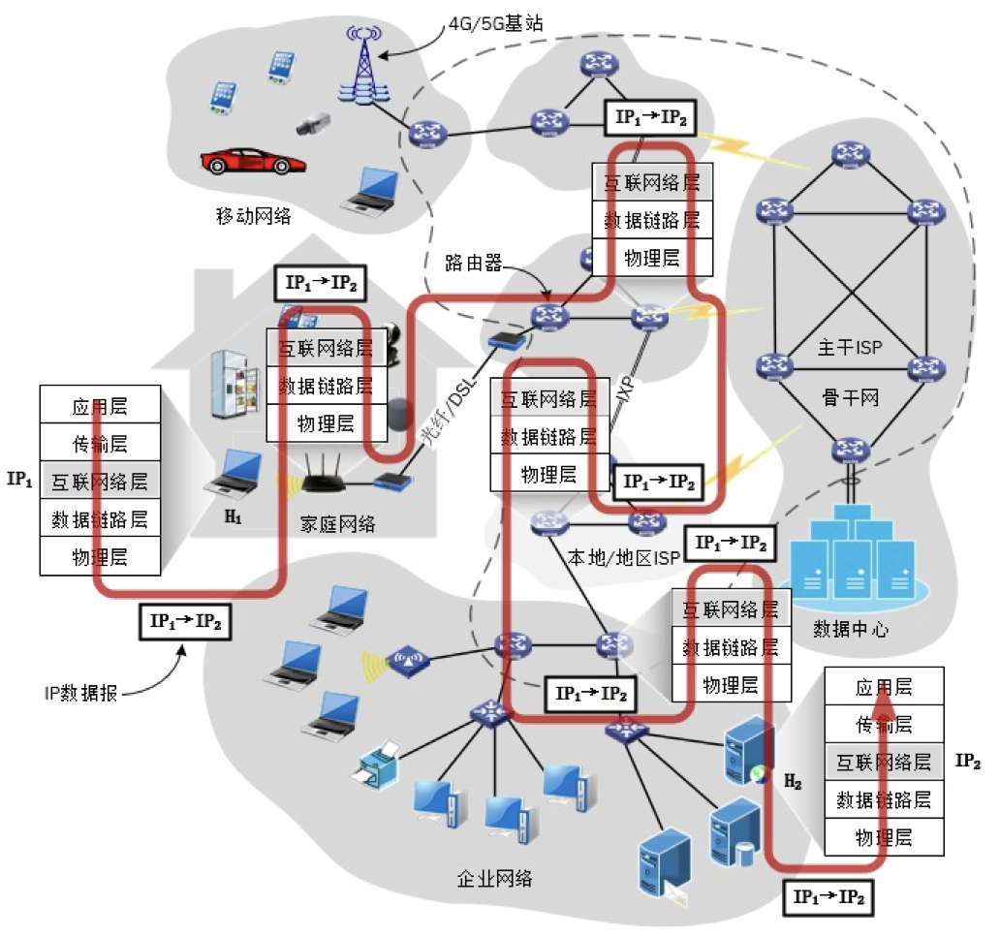

#### 5.2.1 IP数据报格式

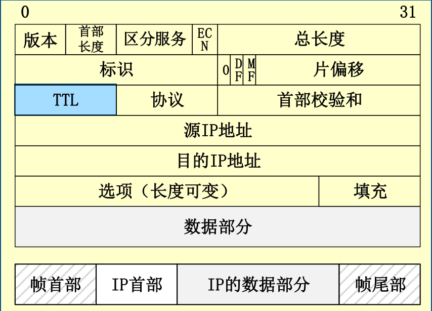

⑴ 版本

+ 版本字段指IP的版本号，占4位
+ 本实例中，版本字段值为4，代表IPv4。

⑵ 首部长度

+ 占4位。首部长度以4字节（32位）为单位。IP首部长度必须是4字节的整数倍。
+ 最大取值为15，对应IP首部最大长度为60字节，因此IP首部的选项部分不超过40字节。
+ 本例中，首部长度字段值为5，代表IP首部长度为20字节。未包含选项。

⑶ 区分服务（DS）

+ 占6位。区分服务字段和后面的ECN最初被RFC791定义为服务类型字段。后来，RFC2474中重新定义了服务类型字段，但仅使用了前6位，命名为区分服务。
+ 区分服务字段可以为不同的业务提供不同种类的服务质量。
+ 本例中，区分服务字段取值为0，代表采用常规的尽力而为交付的IP数据报转发策略
  + 支持区分服务（DS）功能的结点称为DS结点。
  + DS结点对IP数据报采取的转发处理行为称为每跳行为（Per-Hop Behavior，PHB）。不同的PHB种类代表了不同种类的服务质量。
  + 6位DS字段可以定义64个区分服务码点DSCP。
  + 
  + 例：
    + 定义DSCP：101110为加速转发PHB，加速转发PHB提供非拥塞的网络服务，也就是说，对于DSCP为101110的IP数据报，要求DS结点的输出速率大于输入速率。
    + 为IP电话语音业务指定DSCP为101110，即所有承载IP电话语音业务的IP数据报的DSCP字段值设置为101110。
    + 当DS结点转发IP数据报时，即可按照加速转发PHB的要求，提供相应的服务质量。

⑷ ECN

+ RFC3168将区分服务字段之后保留的两位定义为显式拥塞通知ECN。
+ 取值“00”代表端系统不支持ECN；
+ 取值“01”或“10”代表端系统支持ECN；
+ 对于具有ECN能力的路由器，当网络持续拥塞时，会将经过它的IP数据报的ECN字段设置为“11”，以此标记拥塞。

⑸ 总长度

+ 总长度指IP首部和数据部分之和的长度，单位为字节。
+ 占16位，最大值为65535字节。
+ 若总长度超过数据链路层MTU，则需要分
+ 分片后的IP数据报中的总长度字段值为分片的首部和数据部分之和。

⑹ 标识

+ 占16位。用来标识主机发送的每一份IP数据报。
+ 当IP数据报分片时，标识字段的值会被复制到所有的数据报片的标识字段中。

⑺ 标志

+ 占3位，其中第一位保留，尚未使用。
+ 中间一位记为DF位，当 DF=1 时，禁止分片；当 DF=0 时才允许分片。
+ 最低位记为MF位。当 MF=1 时，表示还有更多分片。当 MF=0 时，表示该IP数据报片是最后一个分片。

⑻ 片偏移

+ 用来指出IP数据报分片后，当前分片在原IP数据报中的位置。

+ 占13位，以8字节为单位，如果片偏移字段为n，则代表当前IP数据报片中的第1个数据字节是原IP数据报中的第8n字节。

  + IP数据报总长度超过MTU则需要分片

  + **IPv4中的分片操作可以在发送方主机和任何中间路由器上进行。**

  + 注意：**IPv6的分片操作仅允许在发送方主机上进行。**

  + **IP的重组操作只能在最终目的主机上进行。**

  + 总长度字段、标识字段、标志字段和片偏移字段用来完成IP的分片和重组。

  + IP分片操作时，将原IP数据报的首部复制到各IP数据报片中，并根据需要修改总长度、标志、片偏移等字段的值，重新计算首部检验和。

  + **IP数据报片的数据部分长度需要满足以下3个条件：**

    **① 数据部分长度+首部长度≤MTU；**

    **② 数据部分长度是8字节整数倍，最后一个分片可以不满足该条件；**

    **③ 数据部分长度取满足以上两个条件的数值中的最大值。**

(9)  TTL

+ 字面含义是生存时间，实际含义为跳数限制，占8位。
+ 每台路由器在转发数据报时将该值减1。当TTL值减为0时，路由器丢弃该数据报，并发送一个ICMP差错报告报文给发送方。

**⑽** 协议

+ 协议字段用来指明IP数据报中封装的数据属于哪种协议，占8位。
+ 协议字段用于实现网络层的复用和分用功能。

⑾ 首部检验和

+ IP首部检验和字段仅检验IP数据报的首部，不包括数据部分，占16位。
+ IP首部检验和的计算方法和TCP、UDP的检验和计算方法一样。

⑿ 源IP地址和目的IP地址

+ 源IP地址是发送方主机的IP地址，占32位；目的IP地址是接收方主机的IP地址，占32位。

⒀  选项

+ IP支持一些可供选用的选项，用来进行网络的排错或测量等。
+ IP选项主要包括源路由选项、时间戳选项、记录路由选项等。目前IP选项很少使用。
+ 如果选项长度不满足4字节整数倍，需要用全0字段进行填充。

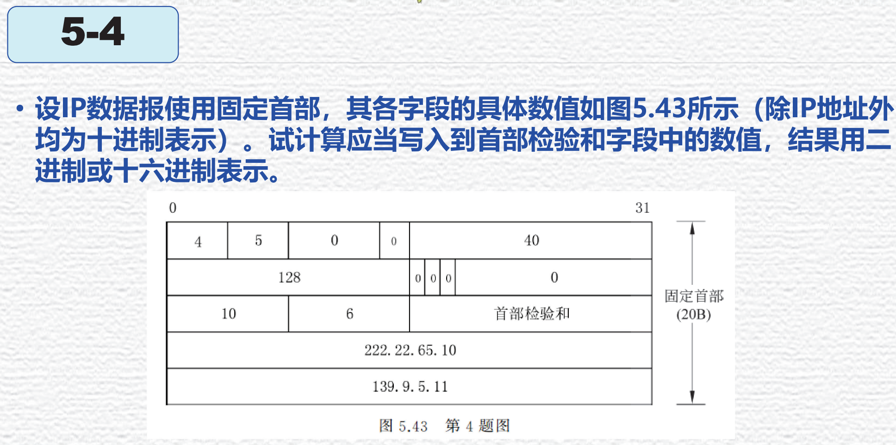


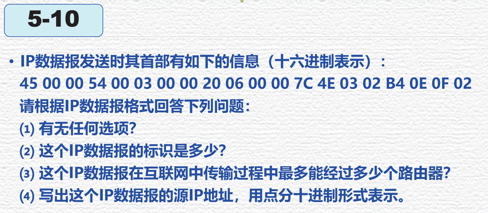


#### 5.2.2 IP分组转发

目的地址：

+ 目的地址是一个32位值，用于与掩码操作结果做匹配。

+ 可以代表以下三种含义：
  + ① 目的主机地址：当掩码是32位，即掩码为255.255.255.255时，目的地址仅能匹配某一个主机的IP地址，这样的路由表项目称为特定主机路由；
  + ② 所有主机：当掩码长度是0位，即掩码为0.0.0.0，且目的地址字段值为0.0.0.0时，该目的地址可以匹配所有的IP地址，这样的路由表项目称为默认路由；
  + ③ 目的网络前缀：当掩码长度是1~31位，目的地址能匹配某个CIDR网络前缀，这样的路由表项目称为目的网络路由

掩码：

+ 掩码指CIDR掩码，长度32位，可以用来和IP数据报中的目的IP地址做掩码操作。

下一跳：

+ 下一跳是一个IP地址，指向一个直接相连的路由器，IP数据报将被转发到该地址。

转发接口：

+ 转发接口是一个网络层使用的标识符，用以指明将IP数据报发送到下一跳的网络接口。
+ 路由表的维护可以由系统管理员手动进行，也可以由一个或多个路由选择协议维护。

结点进行分组转发的过程如下：

① 获取目的IP地址：

+ 解析待发送IP数据报的首部，读取目的IP地址；

② 按照最长前缀匹配算法搜索路由表：

+ 在路由表中搜索所有与目的IP地址“匹配”的路由项目。所谓“匹配”是指：**将目的IP地址与路由项目的掩码字段做按位与操作**，**得到的结果与该项目的目的地址字段值相同**。
+ 在所有与目的IP地址匹配的路由项目中，选出掩码中“1”的位数最多的路由项目，即最长前缀匹配。

③ 按照最长前缀匹配的路由项目进行转发：

+ 读取最长前缀匹配的路由项目的接口字段和下一跳字段，将IP数据报从指定接口发送出去。

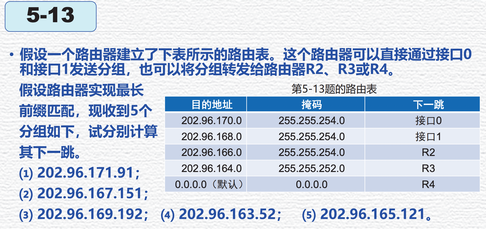

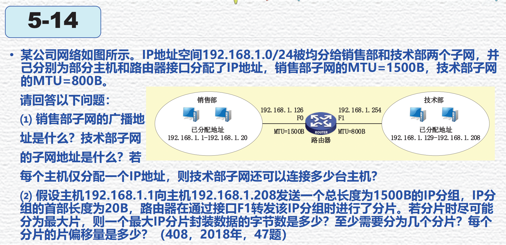

### 5.3 互联网控制报文协议（ICMP）

互联网控制报文协议ICMP负责传送差错报告报文以及其他控制信息，它必须与IP一起实现，通常被认为是网络层的一部分。

ICMP报文可分为两大类：ICMP差错报告报文和ICMP查询/信息报文。


#### 5.3.1 ICMP报文格式和种类

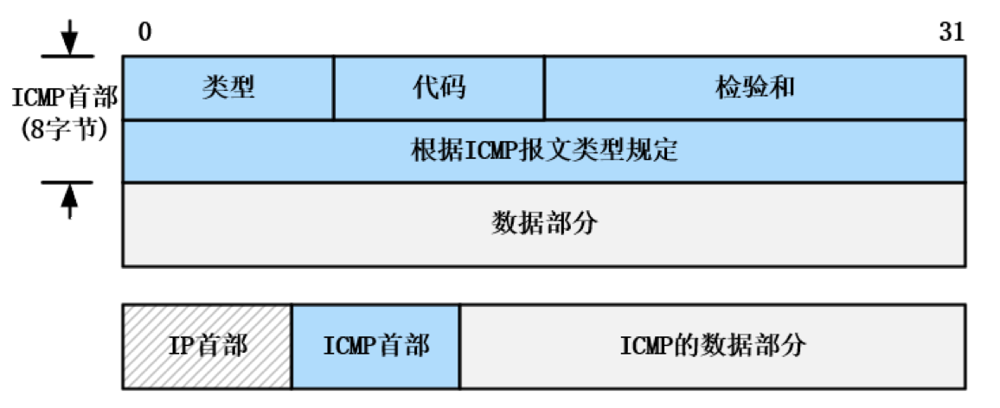

**⑴ 类型**

+ 用来规定ICMP报文的类别，占8位。
+ 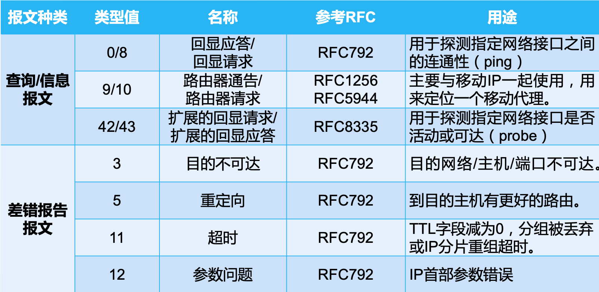

**⑵ 代码**

+ 用于进一步区分相同类型ICMP报文中的不同情况，占8位。
+ 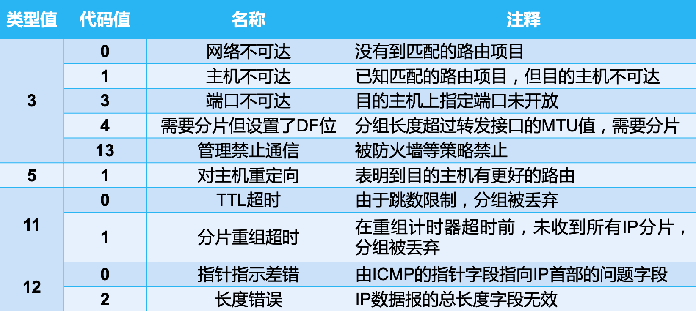

**⑶ 检验和**

+ 用来检验整个ICMP报文，占16位。

#### 5.3.2 ICMP差错报告报文

所有的ICMP差错报告报文中的数据字段都具有同样的格式。

包含一个完整的原始IP数据报（导致差错的IP数据报）的首部副本，以及原始IP数据报的数据部分的前n字节。

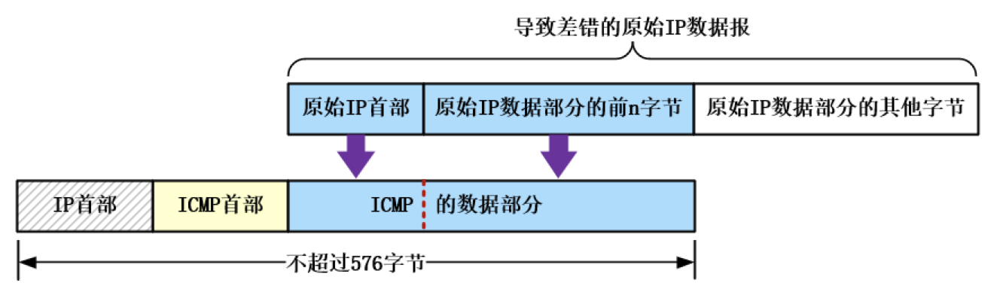

ICMP差错报告报文中应包含原始IP数据报中的尽可能多的数据，但要确保新生成的IP数据报长度不超过576字节。

##### 5.3.2.1 目的不可达差错报告报文

目的不可达差错报告报文用来表示IP数据报无法送达目的地，可能的原因很多。

ICMPv4为此报文定义了16个不同的代码，其中有5个是较常用的，分别是：

+ 网络不可达
  + 当路由器发现IP数据报的目的地址与路由表中所有项目都不能匹配时，即完全不知道该从哪个接口转发时，路由器会丢弃IP数据报并产生网络不可达差错报告报文。
+ 主机不可达
  + 当路由器发现IP数据报可以直接交付，但目的地址指向的主机不在线或者没有正确响应，造成IP数据报无法转发时，路由器会丢弃IP数据报并产生主机不可达差错报告报文。
  + 在IPv4网络中，出现这种差错报告的常见原因是路由器没有收到目的主机的ARP响应。
+ 端口不可达
  + 当目的主机收到IP数据报后，如果发现指定的目的端口号未被任何进程使用，无法向上层转发数据时，目的主机会丢弃IP数据报，并产生端口不可达差错报告报文。
  + 端口不可达差错报告报文和UDP一起使用。
  + 在TCP通信中，如果发现TCP端口号没有绑定应用进程，则返回RST给客户端，TCP连接建立失败。
+ 需要分片
  + 当路由器收到DF为1的IP数据报，但转发时发现下一跳链路的MTU值小于该IP数据报的总长度时，路由器丢弃IP数据报，并产生需要分片、但设置了不可分片位差错报告报文
  + 该报文可简称为需要分片差错报告报文。
+ 管理禁止通信
  + 在IP数据报转发路径中，如果路由器或目的主机的管理员配置了某种丢包规则，当丢弃IP数据报时，路由器或目的主机将产生管理禁止通信差错报告报文。
  + 管理员通常并不希望向源主机通告丢包规则，因此管理员可以配置不发送差错报告报文，或者发送一个其他的差错报告报文。

##### 5.3.2.2 重定向差错报告报文

+ 如果路由器收到一个IP数据报，查找路由表后发现自己并不是将该IP数据报投递到目的地址的最佳路由，则该路由器发送一个重定向差错报告报文给源主机，同时仍然将该IP数据报转发到正确的下一跳路由器。
+ 路由器比较IP数据报的输入接口是否与其下一跳转发接口相同，如果输入接口等于输出接口，则需要产生重定向差错报告报文。

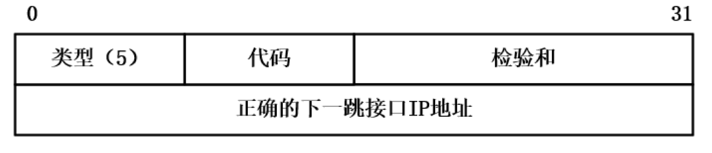

##### 5.3.2.3 超时差错报告报文

+ 每台路由器在转发数据报时都将IP数据报中的TTL值减1。
+ 当TTL值减为0时，路由器丢弃该IP数据报，并发送一个超时差错报告报文给源主机。

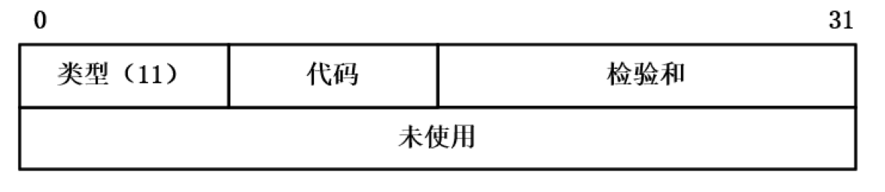

#### 5.3.3 ICMP应用实例


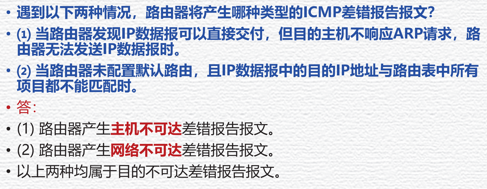

### 5.4 路由选择协议

可以用图来形式化描述路由选择算法。

图 G=(N, E)是一个具有N个顶点和E条边的集合。

图中的一个顶点代表一台路由器或者一个其他结点，这是做出分组转发决定的点。

两个顶点之间的边代表两台相邻路由器之间的链路。每条边用一个值代表它的开销。

E中的任一条边(x,y)，我们用𝐜(𝐱,𝐲)代表边(𝐱,𝐲)的开销。

一旦图中的每条边都给定了开销，路由选择算法找出从源到目的之间的最低开销路径，即最佳路径

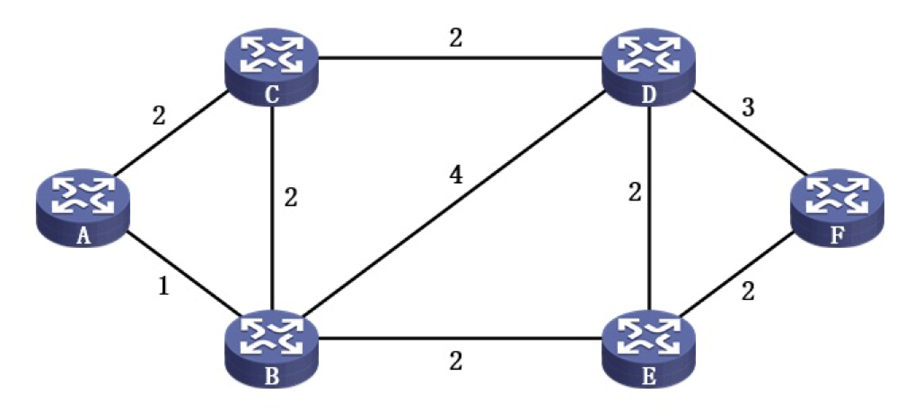

路由选择协议为路由选择算法传递和提供边的“开销”。

不同的路由选择协议，采用不同的度量指标，对边的开销的定义也不同。

即使网络拓扑相同，不同的路由协议也有可能得出不同的最佳路由。

常用的路由选择算法包括：

+ 距离向量算法（DV）
+ 链路状态算法（LS）
+ 路径向量算法（PV）

+ 外部网关协议(EGP)
  在自治系统之间使用的路由选择协议
  也称为**域间路由选择**协议
  常见协议：
  边界网关协议(BGP)

+ 内部网关协议(IGP)
  在一个自治系统内部使用的路由选择协议
  也称为**域内路由选择**协议
  常见协议：
  路由信息协议(RIP)
  开放最短通路优先(OSPF)协议

#### 5.4.1 路由信息协议（RIP）

(1)距离向量算法（DV）：

DV算法不需要知道网络的全局信息，它是一种分布式的、迭代的、异步的算法。

DV算法的基础是Bellman-Ford方程
$$
𝐝（𝐱,𝐲）=𝐦𝐢𝐧_𝐯 \{𝐜(𝐱,𝐯)+𝐝(𝐯,𝐲)\}，𝐯∈\{𝐱的邻居顶点\}
$$


Bellman-Ford方程给出了一种求顶点x到顶点y的最低开销的方法。DV算法利用Bellman-Ford方程求解最短路径。

遍历x的所有邻居顶点v，计算x到邻居顶点v的开销与v到y的最低开销之和，其中的最小值就是x到y的最低开销。

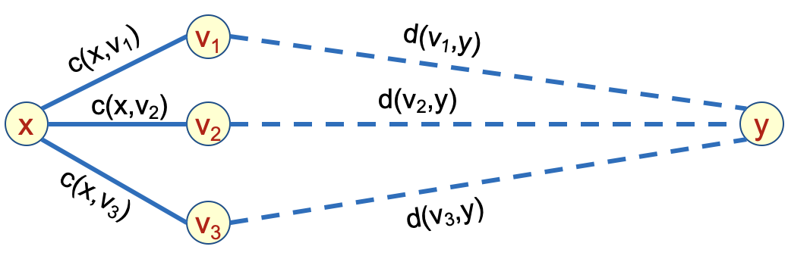

(2)RIP概述:

RIP规定所有路由器到与其直接连接的网络的开销为1。

RIP将两台路由器之间的最低开销称为“距离”，也称为“跳数”。每经过一台路由器，跳数加1。

RIP允许一条路径的“距离”的最大值为15，因此“距离”等于16即相当于不可达。

RIP仅适用于小型自治系统。

(3)RIP更新算法:

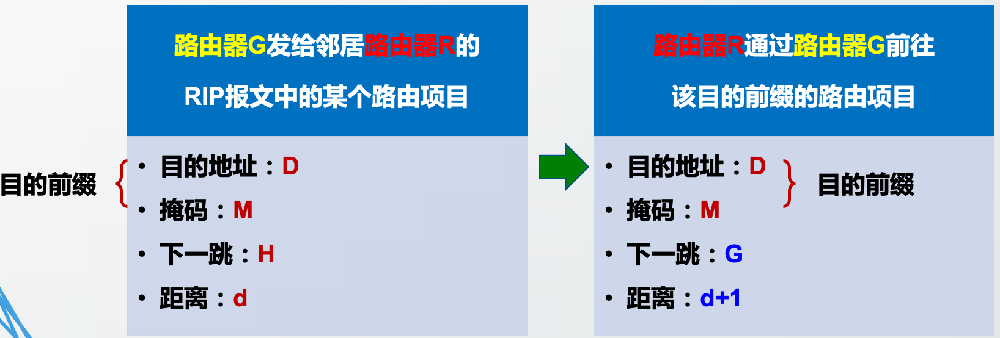

+ 收到来自邻居路由器G的RIP报文时，路由器R首先对RIP报文中的每一个路由项目，将距离加一，即改为𝐝+𝟏，并将下一跳记为G。

+ 然后对RIP报文中的每一个路由项目，按照以下算法更新路由信息数据：
  ① 如果原路由信息数据中不包含该目的前缀（目的地址=D 且 掩码=M）的路由项目，则把RIP报文中的项目添加到原路由信息数据中；
  ② 如果原路由信息数据中包含该目的前缀（目的地址=D 且 掩码=M）的路由项目，且其下一跳地址是G，则用RIP报文中的项目更新原路由信息数据中的路由项目。
  ③ 如果原路由信息数据中包含该目的前缀（目的地址=D 且 掩码=M）的路由项目，但下一跳地址不是G，则需要比较距离。只有RIP报文中项目的距离（𝐝+𝟏）小于原路由信息数据中的距离，才用RIP报文中的项目更新原路由信息数据中的路由项目。

+ 根据路由信息数据更新路由表。

(3)RIP其他规定:

路由器最初仅知道直连网络的路由信息。

RIP规定每间隔30秒，路由器都需要发送RIP路由更新报文给所有邻居。RIP路由更新报文中的路由项目包括本路由器已知的全部路由信息。

每台路由器只和数目有限的相邻路由器交换并更新路由信息。

RIP规定超时计时器，默认为3分钟，若超时计时器到期，仍未收到邻居路由器G的路由更新报文，则将下一跳为G的所有路由都标记为无效，即将距离修改为16。

RIP规定垃圾回收计时器，默认为2分钟，若垃圾回收计时器到期，才会删除无效路由项目。

(4)RIP报文格式：

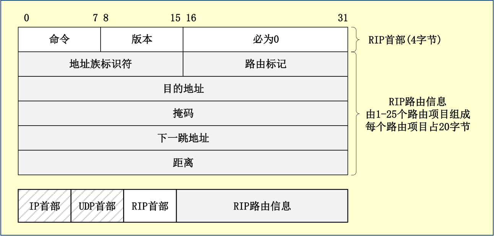

#### 5.4.2 开放最短通路优先（OSPF）

（没有题，粗略看一下）

OSPF是互联网的正式标准，IPv4使用的是第2版的OSPF，由RFC2328规定。

OSPF也支持CIDR，其最大特点是支持在自治系统内再次分层。

OSPF支持身份鉴别。

OSPF采用链路状态算法。

(1)链路状态算法（LS算法）：

LS算法是一种使用全局信息的算法。

在LS算法中，网络拓扑和所有的链路开销都是已知的，可以用作LS算法的输入，计算最小开销。

在实践中，链路开销通常通过链路状态广播通知给网络中的其他路由器。

链路状态广播的结果就是网络中的所有路由器都拥有包含网络拓扑和所有链路开销的一致数据，这些数据称为链路状态数据库（LSDB）。

LS算法利用链路状态数据库进行路由计算。

基于链路状态的路由选择分为两个阶段：链路状态广播阶段和路由计算阶段。

OSPF采用的LS算法是Dijkstra算法。

#### 5.4.3 边界网关协议（BGP）

（没有题，粗略看看）

边界网关协议BGP是目前域间路由协议的事实标准，其当前版本号为4，记为BGP-4，由RFC4271规定。

BGP一直被认为是互联网最复杂的部分之一。

BGP支持CIDR，支持鉴别。

BGP采用路径向量算法，寻找有效路径。

BGP基于策略，选择“最佳”路由。

### 5.5 专用网相关概念

专用网是指企业或机构内部专用的网络。

专用网上的主机与公用的互联网上的主机通信需要利用网络地址转换(NAT) 。

专用网上的地址称为专有地址（Private Address） ，它们仅需要在一定的范围内唯一。在互联网的不同部分，这些IP地址可以被重复使用。

网络地址转换也被用来延缓IP地址空间耗尽。

需要向IANA申请才能使用的全球唯一的IP地址称为全球地址（Global Address）或公网地址。

使用NAT需要在专用网络连接到互联网的路由器上安装NAT软件。

安装了NAT软件的路由器称为NAT路由器，它至少应具有一个有效的全球地址。

NAT存在两种形式：

1. 基本NAT
2. 网络地址与端口转换（NAPT）


## 第六章

掌握概述部分，除了流量控制

以太网——网桥和交换机要求会应用（自学习算法原理，交换机例子——最后交换表是什么（计算））vlan广播域，Q标签真格式对比，

ARP地址解析过程会应用（解析吓一跳地址，广播ARP请求/单播ARP响应）

熟悉无线局域网组成，要求比较高的是MAC针的格式，控制帧最重要。

MAC分布协调功能DCF

PPP协议的组成、帧的封装的方式

### 6.1 帧定界方法

#### 6.1.1 标志字符法

定界方法：对于以字符为基本传送单元的协议，可以指定特殊字符作为帧开始和帧结束的标志字符，称为帧定界符。

透明传输：如果标志字符出现在数据中时，会干扰帧定界功能的实现。采用字符填充法实现透明传输。

典型协议：PPP协议用于异步传输时，采用标志字符法。

帧定界符：0x7E

转义字符：0x7D

#### 6.1.2 标志位法

定界方法：对于以二进制位（比特）为基本传送单元的协议，可以指定特殊的位组合作为帧开始或帧结束的标志。 

透明传输：采用二进制位填充法，避免传送的数据中包含标志位组合，实现透明传输

典型协议：高级数据链路控制协议HDLC，以及PPP协议用于同步传输时，采用标志位法实现帧定界，规定位串01111110作为帧开始和帧结束标志。

并采用零比特填充法实现透明传输。

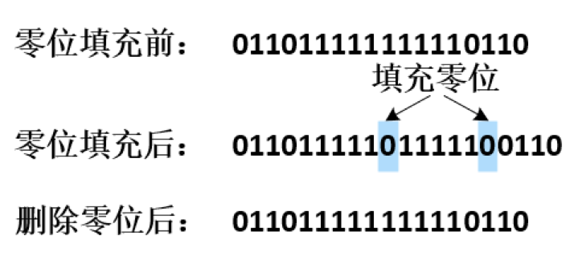

#### 6.1.3 特殊的物理层编码法

定界方法：利用物理层的特殊编码标记帧的边界。要求：物理层编码方案中包含冗余编码。

透明传输：由于冗余编码不会出现在常规数据中，因而不需要额外处理，即可实现透明传输。

典型协议：以太网协议采用特殊的物理层编码法。

### 6.2 寻址

MAC地址分为两个部分，每部分占3字节。

+ 组织唯一标识符OUI：前三个字节（高24位），由IEEE的注册管理机构负责分配；

+ 扩展标识符EI：后三个字节（低24位），由获得OUI的厂商自行分配。

MAC地址的最高字节的最低位为I/G位。

+ I/G位为0时， MAC地址代表单站地址
+ I/G位为1时，MAC地址代表组地址。

MAC地址的最高字节的次低位为U/L位

+ U/L位为0时代表全局管理
+ U/L位为1时代表本地管理

48位全为1的地址是广播地址

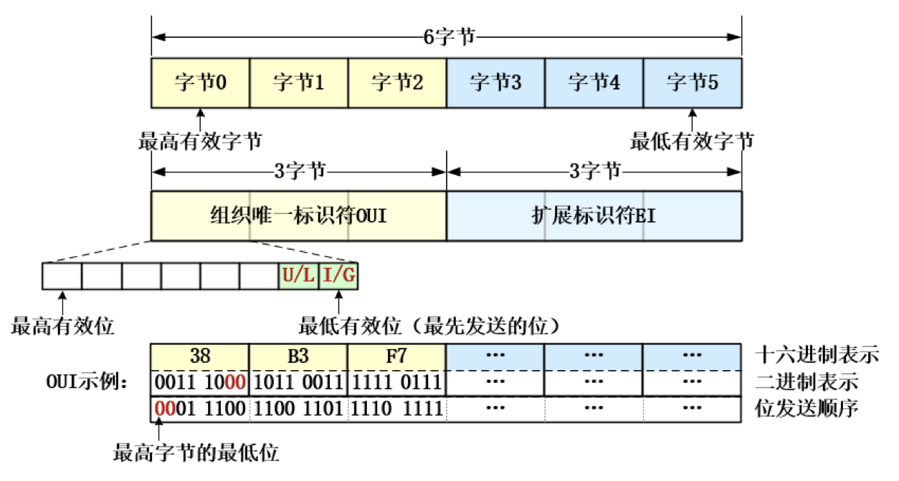

### 6.3 差错控制

在数据链路层，目前应用广泛的差错检测算法是循环冗余检验（Cyclic Redundancy Check，CRC）

冗余码和帧检验序列FCS

发送方，把数据划分为组，每次发送一组数据。

假定每组数据k比特，将待发送数据记为M。

发送方利用CRC算法在数据M的后面添加供差错检测用的r比特冗余码，一起发送出去

对于一个帧来说，为了进行检错而添加的冗余码常称为帧检验序列FCS

在数据后面增加r比特冗余码，增大了数据传输的开销，但提供了差错检测能力

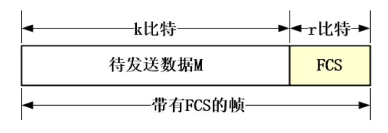

① 计算2^r×M，这相当于在M后面添加r个0，得到一个(k+r)位的二进制数。

② 用得到的(k+r)位数除以收发双方事先商定的二进制数P，得出的商记为Q，而余数记为R。

R就是CRC算法计算的冗余码。

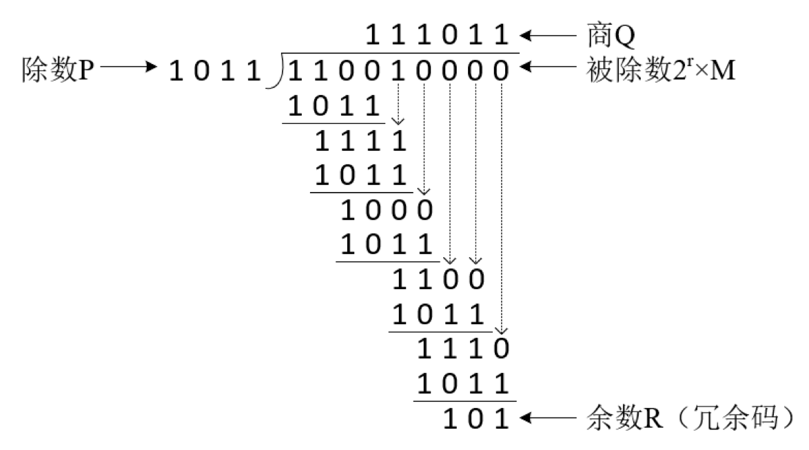

CRC检验也称为多项式编码，其基本思想是将二进制数看作系数为0或1的多项式，对二进制数的计算被解释为多项式计算。

收发双方商定的P来源于生成多项式P(𝑥)，其最高位和最低位系数必须是1。

经过精心挑选的生成多项式P(𝑥)可以确保CRC算法漏判的概率极低。

CRC-32被IEEE应用在包括以太网在内的多种数据链路层协议中：


CRC-32中的二进制数P：


CRC属于检错码。

### 6.4 介质访问控制（MAC）

实现介质访问控制的方法可以分为三类：

1. 静态信道分配方法
2. 随机接入方法
3. 受控接入方法 

#### 6.4.1 静态信道分配方法

常见的静态信道划分方法包括频分多路复用、时分多路复用和码分多路复用。

码分多路复用也称为码分多址（CDMA）。

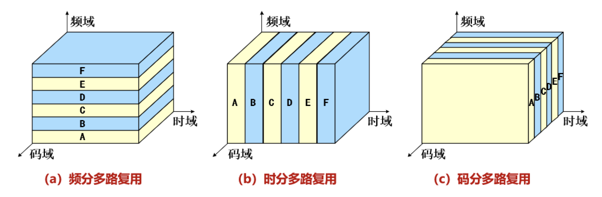

频分多路复用：

频分多路复用FDM将信道的划分为N个不同的频段，

把每个频段分配给N个站点中的一个。

时分多路复用：

时分多路复用TDM将时间划分为时间帧，称为时分多路复用帧，并进一步将每个TDM帧划分为N个时隙（slot）。

把每个时隙分配给N个站点中的一个。 

码分多址：

码分多址CDMA为每个站点分配一种不同的码片序列，这些精心选择的码片序列两两正交。

每个站点用它唯一的码片序列对它发送的数据进行编码。

#### 6.4.2 随机接入方法

随机接入方法是一种基于争用的信道分配方法。

随机接入的特点是所有站点可随机地发送数据。

如果恰巧有两个或更多的站点在同一时刻发送数据，那么在共享信道上就会产生了冲突。随机接入方法必须有处理冲突的方法。

随机接入的MAC协议主要包括：

+ 纯ALOHA
+ 时隙ALOHA
+ CSMA/CD：带冲突检测的载波监听多路访问
+ CSMA/CA：带冲突避免的载波感应多路访问

### 6.5 以太网的帧格式

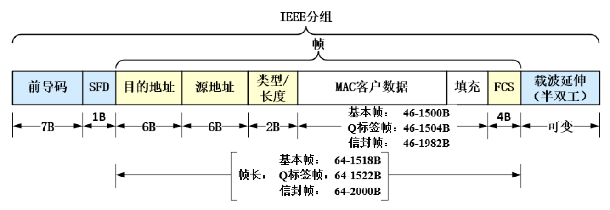

+ 前导码：

占7个字节，取值为交替的1和0。其作用是使接收端的适配器在接收MAC帧时能够迅速调整其时钟频率， 实现位同步”

+ 帧开始符SFD：

占1个字节，取值“10101011”。SFD的前六位的作用和前导码一样，最后的两个连续的“1”代表帧即将开始传送。

+ 目的地址：

占6字节，接收方MAC地址。

+ 类型/长度：

占2字节。由于历史原因，该字段包含两种含义。当取值小于等于1500时，该字段理解为长度字段，代表基本帧中MAC客户数据的字节数。当取值大于等于1536时，该字段理解为类型字段，代表MAC客户协议类型。

+ 源地址：

占6字节，发送方MAC地址。

+ MAC客户数据（MAC Client Data）：

MAC客户数据包含可选的标签和上层协议数据。

IEEE 802.3定义了三种类型的以太网帧：基本帧（basic frame）、Q标签帧（Q-tagged frame）和信封帧（envelope frame）。

基本帧不包含标签，Q标签帧和信封帧包含标签。

+ 填充：

以太网最小帧长为64字节。当上层协议交下来的数据小于46字节，将导致封装的以太网帧不足64字节，以太网协议实体必须在填充字段用“0”补足。

+ 帧检验序列FCS：

占4字节，利用CRC算法进行帧检验。帧检验计算范围包括目的地址、源地址、类型/长度、MAC客户数据和填充字段。

以太网的FCS采用IEEE标准的CRC32进行计算利用CRC算法进行帧检验。

+ 载波延伸：

在千兆以太网中，当工作在半双工模式时，为了保持CSMA/CD协议的有效性，需要在较短的帧后补充载波延伸字段，该字段值全为“0”。

当工作在全双工模式时，不需要该字段。

### 6.6 网桥和交换机

- 我们可以使用中继器或集线器来扩展以太网的地理覆盖范围。
- 中继器和集线器都属于物理层设备，通过中继器或集线器的接口连接在一起的所有站点都处于同一个**冲突域**。
- **冲突域指的是站点发送的物理层信号可以到达的范围**。
- 处于同一个冲突域内的站点，在任一时刻只能有一个站点发送数据，否则将会发生冲突。
- 随着100BASE-T网络和交换机的普及，集线器最终被**交换机**所替代。交换机本质上是多接口、高性能的网桥。
- 交换机工作在数据链路层，也称为**二层交换机**。
- 交换机的每个端口下连接的站点处于同一个冲突域。

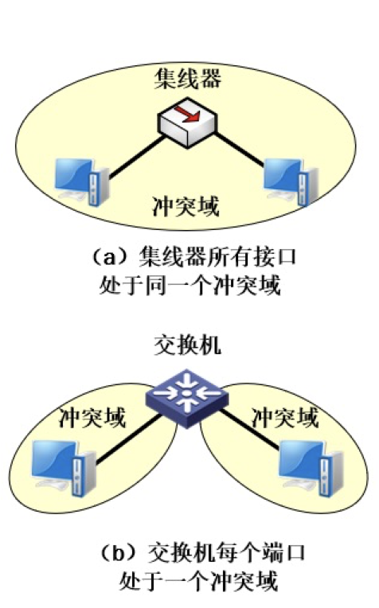

每台交换机维护一张或多张交换表，其中包括三个字段：

1. MAC地址：记录与特定端口相关联的设备的MAC地址。
2. 端口：指示与特定MAC地址相关联的设备所连接的交换机端口。
3. 老化时间：记录自学习该条目后经过的时间。

当交换机接收到一个数据帧时，它会首先进行自学习，将数据帧中源MAC地址与接收到的端口相关联，并将该信息添加到交换表中。然后，交换机根据交换表中的信息，将数据帧转发到目标MAC地址对应的端口。

如果交换表中的某个条目的老化时间达到了设定的“有效期”，交换机将会删除该条目，以确保交换表中的条目与网络中的设备保持同步和准确性。这样，交换表可以根据网络流量和设备的连接状态进行动态更新和维护，以提供高效的数据转发。

- **自学习算法**
- 交换机使用数据帧中的源MAC地址查找交换表。
- 如果找不到匹配的项目，则将源MAC地址和对应的端口写入交换表。
- 如果能找到匹配的项目，则更新老化时间。
- **转发算法**
- 交换机使用数据帧中的目的MAC地址查找交换表。
- 如果找不到匹配的项目，则将数据帧向除接收端口以外的所有端口进行转发。
- 如果能找到匹配的项目，则根据交换表中指定的端口进行转发。
- 如果交换表中指定的端口正好是接收端口，则丢弃数据帧，不进行转发。