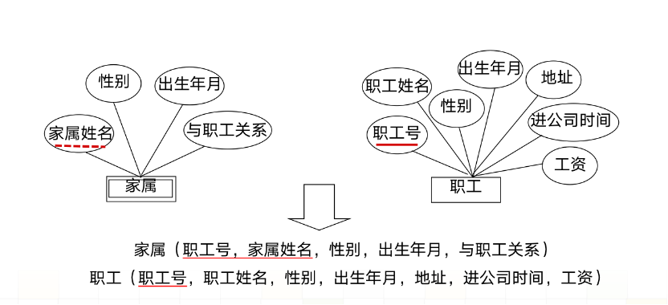
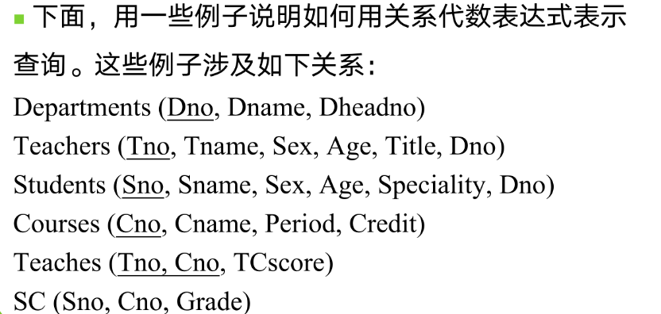
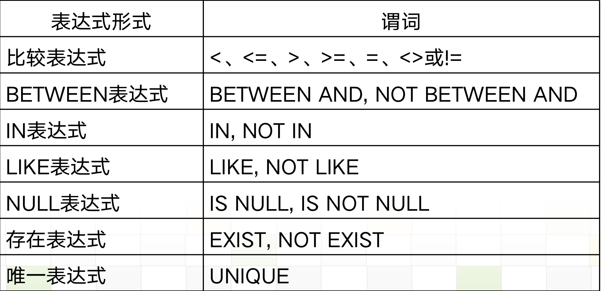

# 数据库期末复习

---

[TOC]


## 需要掌握的概念和术语

### DBMS

DBMS是一种重要的程序设计系统，它由一个相互关联的数据集合和一组访问这些数据的程序组成。DBMS的主要功能包括数据定义、数据操作、事务管理和运行管理、数据存储和查询处理、数据库维护等

### 数据模型的三要素

数据结构：描述数据库中的对象和对象之间的联系，是对系统静态特性的描述

数据操作：查询和更新（包括插入、删除、修改）

完整性约束：是一组规则，保证数据的正确、有效和相容

### 码


### 超码

能够惟一确定实体集中每个实体的属性集称为该实体集的超码

### 候选码

真子集都不是超码的极小超码，并称之为候选码

### 实体完整性

关系R的所有元组在主码上的值必须唯一，并且在主码的任何属性上都不能取空值

### 参照完整性

如果属性集FK是关系R的外码，它参照关系S的主码Ks，则R的任何元组在FK上的值或者等于S的某个元组在主码Ks上的值，或者为空值

### 触发器

是特殊类型的存储过程，当某个事件发生时它自动执行 要设置触发器机制

### 函数依赖

某个属性集决定另一个属性集时，称另一属性集依赖于该属性集。

### 视图


### 索引&&建立索引的原则


### 事务 事物的特性 死锁

事务:事务是用户定义的一个数据库的操作序列，这些操作要么全做, 要么全不做，是一个不可分割的工作单元；事务是并发控制与调度的基本单位，也是数据库恢复的基本单位

事务的特性：ACID

死锁发生时，两个或多个事务都处于等待状态，每个事务都等待其它事务释放锁，以便可以继续执行 

### 日志

+ 日志是日志记录的序列，记录数据库中所有的更新活动 日志登记每个事务的开始标记、结束标记和所有更新操作 

+ 事务结束可能是正常提交（commit），也可能是异常中止（abort） 

+ 事务的更新可能是插入、删除和修改 

## 第一章

### DBMS提供哪些子语言（3个）

数据定义语言 (Data Definition Language):用于定义数据库模式

数据操纵语言(Data Manipulation Language):用于表达数据库的查询和更新

数据控制语言(Data Control Language):用于定义用户对数据对象的访问权限

### 数据模型的三要素

数据结构：描述数据库中的对象和对象之间的联系，是对系统静态特性的描述

数据操作：查询和更新（包括插入、删除、修改）

完整性约束：是一组规则，保证数据的正确、有效和相容

### DBMS三模式，两级影响结构如何保证数据独立性

三级模式：外模式，模式，内模式

两级映像：外模式-模式映像，模式-内模式映像

#### 如何保证数据独立性

 数据的逻辑独立性是指应用程序与数据库的逻辑结构之间的相互独立性 由外模式-模式映像保证

 数据的物理独立性是指应用程序与存储在磁盘上的数据库中数据之间的相互独立性 由模式-内模式映像保证

### DBA的主要职责

1. 周期性转储数据库，防止灾难发生导致数据库被破坏。
2. 当系统故障发生时，重启系统并利用日志将数据库中的数据恢复到先前的一致状态;当介质故障发生时，修复或更换存储介质，重启系统并利用转储和日志将数据库中的数据恢复到先前的一致状态
3. 监视系统的运行，在系统性能下降时，调整物理存储结构，建立必要的索引，确保系统有效运行
4. 设置必要的审计，监视审计文件

## 第二章

### 联系的类型

#### 一对一

如果E1中的每个实体最多与E2中的一个实体相关联，并且E2中的每个实体也最多与E1中的一个实体相关联，则称E1和E2之间联系为一对一联系

#### 一对多

#####  一对多联系（1:n联系）

如果E1中的每个实体都可以与E2中任意多个实体相关联，而E2中的每个实体最多与E1中一个实体相关联，则称这种联系为E1到E2的一对多联系 

##### 多对一联系（n:1联系）

如果E1中的每个实体最多与E2中的一个实体相关联，而E2中的每个实体都可以与E1中任意多个实体相关联，则称这种联系为E1到E2的多对一联系

#### 多对多联系（m:n联系）

如果E1中的每个实体都可以与E2中任意多个实体相关联，并且E2中的每个实体也可以与E1中任意多个实体相关联，则称E1和E2之间联系为多对多联系 例如，学生和课程之间的联系“选修”就是多对多联系

### 针对具体应用能设计出系统的ER图

[例子](https://www.cnblogs.com/vvlj/p/12750674.html)

## 第三章

实体/参照完整性内容及运用（判断两个表是否违反参照完整性）

ER图向关系模型的转换，码的确定

掌握关系代数的基本和附加运算，能用关系代数表示查询,扩展运算，分组聚集运算也需要看一下

自然，等值连接的区别和连接后的结果

### 实体/参照完整性内容及运用


### ER图转换为关系模式：

#### 对联系集的处理：
+ 联系是一对一的，则每个实体集的码都是关系的码
+ 联系是一对多（多对一）的，则“多端”实体集的码构成关系的码
+ 联系是多对多的，则参与联系的所有实体集的码组合成关系的码

* [实例](https://blog.csdn.net/m0_65621953/article/details/125190581)
* [实例+教程](https://zhuanlan.zhihu.com/p/359465552)

### 关系代数:
#### 然连接和等值链接的区别:
1. 自然连接一定是等值连接，但等值连接不一定是自然连接。
2. 等值连接要求相等的分量，不一定是公共属性；而自然连接要求相等的分量必须是公共属性。
3. 等值连接不把重复的属性除去；而自然连接要把重复的属性除去。
#### 例题:

##### 简单
1. 列出系编号为MA（数学系）的所有学生的详细信息
2. 列出所有课程的课程号、课程名和学分
3. 列出年龄不超过45岁的所有副教授的姓名、性别和年龄。
4. 列出选修了课程号为CS201的课程的所有学生的学号。
##### 复杂
1. 列出选修了课程号为CS201的课程的所有学生的学号和姓名。
2.  列出每个学生选修的每门课程的成绩，要求列出的学号、姓名、课程名和成绩。
3.  求评估得分高于90分的教师所在院系名称、教师姓名、课程名和评估得分（TCscore）。
4.  除运算RS适合于包含短语“S中全部（所有）”的查询。
5. 列出所有选修了全部课程的学生的学号和姓名。

## 第四章

SQL的五个特点

用SQL创建基本表和索引

SELECT实现查询

数据更新（INSERT DELETE UPDATE）

视图的作用（4个）视图的定义SQL语句，基于视图的查询更新

### SQL的五个特点

集多种数据库语言于一体 

高度非过程化 

面向集合的操作方式  

一种语法两种使用方式 

功能强大，语言简洁 

### 符号约定
1. <X>表示X是需要进一步定义或说明语言成分
2. [X]表示X可以缺省或出现一次
3. {X}表示X可以出现一次
4. X | Y表示或者X出现，或者Y出现，但二者不能同时出现
5. SQL语言的保留字（如CREATE）不区分大小写。为醒目起见，对于SQL语句中的SQL的保留字，我们使用大写

### 模式
#### 创建
```SQL
CREATE SCHEMA <模式名> [<模式元素>…]
```
+ 创建一个以<模式名>命名的模式，并可以在创建模式的同时为该模式创建或不创建模式元素
+ <模式元素>可以是表定义、视图定义、断言定义、授权定义等
+ 这种格式没有授权其他用户访问创建的模式，以后可以用授权语句授权
```SQL
CREATE SCHEMA [<模式名>] AUTHORIZATION <用户名> [<模式元素>…]
```
+ 与第一种的区别在于它将创建的模式授权予<用户名>指定的用户
+ 当<模式名>缺省时，用<用户名>作为模式名
##### 例题

#### 删除
```SQL
DROP SCHEMA <模式名> CASCADE∣RESTRICT 
```
+ CASCADE，则删除<模式名>指定模式得同时并删除该模式中的所有数据库对象（基本表、视图、断言等）
+ RESTRICT，则仅当<模式名>指定的模式不包含任何数据库对象时才删除指定的模式，否则拒绝删除
##### 例题
删除一个模式
```SQL
DROP SCHEMA Supply_schema RESTRICT
/*仅当模式Supply_schema中不包含任何数据库对象时，才删除模式Supply_schema，否则什么也不做。而*/
DROP SCHEMA Supply_schema CASCADE
/*将直接删除模式Supply_schema，并同时删除该模式中所有的数据库对象'*/
```
### 表
#### 创建表
```SQL
 CREATE TABLE <表名> 
(<列名><数据类型> [DEFAULT <缺省值>] [列级约束定义],
<列名><数据类型> [DEFAULT <缺省值>] [列级约束定义],
 …, 
[<表级约束定义>, …, <表级约束定义>])；
```
##### 列级约束
```SQL
 [CONSTRAINT <约束名>] <列约束> 
```
###### 约束名取值:
* NOT NULL：不允许该列取空值；不加NOT NULL限制时，该列可以取空值
* PRIMARY KEY：指明该列是主码，其值非空、惟一
* UNIQUE：该列上的值必须惟一。这相当于说明该列为候选码
* CHECK (<条件>)：指明该列的值必须满足的条件，其中<条件>是一个涉及该列的布尔表达式
  
##### 表级约束
```SQL
 [CONSTRAINT <约束名>] <表约束> 
```
###### 约束名取值:
* PRIMARY KEY (A1, …, Ak)：说明属性列A1, …, Ak构成该关系的主码
* UNIQUE (A1, …, Ak)：说明属性列A1, …, Ak上的值必须惟一，这相当于说明A1, …, Ak构成该关系的候选码
* CHECK (<条件>)：说明该表上的一个完整性约束条件
* FOREIGN KEY (A1, …, Ak) REFERENCES <外表名> (<外表主码>) [<参照触发动作>]
##### 例子
1. 创建一个Teachers表
```SQL
CREATE TABLE Teachers（
Tno 	CHAR (7)   PRIMARY KEY,
Tname	CHAR (10) NOT NULL,     
Sex 	CHAR (2)   CHECK (Sex= ‘男’ OR Sex= ‘女’),     
Birthday	DATE,        
Title	CHAR (6),
Dno	CHAR (4),
FOREIGN KEY (Dno) REFERENCES Departments (Dno)
);
```
2. 创建选课表SC:
```SQL
CREATE TABLE SC (
Sno     CHAR (9),
Cno     CHAR (5),
Grade  SMALLINT CHECK (Grade>=0 AND Grade<=100),
PRIMARY KEY (Sno,Cno),
FOREIGN KEY (Sno) REFERENCES Students (Sno),
FOREIGN KEY (Cno) REFERENCES Courses (Cno)
);
```
#### 修改表
```SQL
 ALTER TABLE <表名>
[ADD [COLUMN] <列名><数据类型>[列级约束定义]]
[ALTER [COLUMN] <列名> {SET DEFAULT <缺省值> | 						DROP DEFAULT}]
[DROP [ COLUMN ] <列名> {CASCADE | RESTRICT}]
[ADD <表约束定义>]
[DROP CONSTRAINT <约束名>{CASCADE | RESTRICT}]
```
##### 例子
1. 在Courses中增加一个新列Pno，表示课程的先行课的课程号
```SQL
	ALTER TABLE Courses ADD Pno CHAR (5); 
```
2. 在Students的Sex列设置缺省值“女”可以减少大约一半学生性别的输入
```SQL
	ALTER TABLE Students ALTER Sex SET DEFAULT ‘女’;
```
3. 删除Sex上的缺省值可以用
```SQL
	ALTER TABLE Students ALTER Sex DROP DEFAULT;
```
4. 删除Courses中的Pno列可以用
```SQL
	ALTER TABLE Courses DROP Pno;
```
#### 删除表
```SQL
 DROP TABLE <表名> {CASCADE∣RESTRICT}
```
1. 其中CASCADE表示及联删除，依赖于表的数据对象（最常见的是视图）也将一同被删除
2. RESTRICT表示受限删除，如果基于该表定义有视图，或者有其他表引用该表（如CHECK、FOREIGN KEY等约束），或者该表有触发器、存储过程或函数等，则不能删除
##### 例子
如果用如下语句删除SC表
```SQL
DROP TABLE SC RESTRICT;
```
仅当没有依赖于SC的任何数据库对象删除才能成功。

如果用
```SQL
DROP TABLE SC CASCADE;
```
则表SC和依赖于它的数据库对象都被彻底删除。

### 索引
#### 创建索引
```SQL 
CREATE [UNIQUE] [CLUSTER] INDEX <索引名> ON <表名> (<列名> [<次序>]{,<列名> [<次序>]})
-- UNIQUE缺省时，创建的是非唯一性索引
-- CLUSTER缺省时是非聚簇索引
```
1. <索引名>为建立的索引命名
2. <表名>是要建立索引的基本表的名字
3. 索引可以建在该表的一列或多列上，各列名间用逗号分隔；每个列名后可以用<次序>指定索引值的排列次序
4. 次序可以是ASC（升序）和DESC（降序），缺省为ASC
##### 例题
在Students的Dno上创建一个名为Student_Dept的索引
```SQL
CREATE INDEX Student_Dept ON Students (Dno);
```
 在Teachers上的Dno创建一个名为Teacher-Dept的聚簇索引
```SQL
CREATE CLUSTER INDEX Teacher_Dept ON Teachers (Dno);
```
注意：学生流动性比较大，Students更新频繁，不适合创建聚簇索引；而教师相对稳定，可以考虑按所在院系在Teachers上创建聚簇索引
#### 删除索引
```SQL
DROP INDEX <索引名>
```
### 数据查询
```SQL
SELECT [ALL︱DISTINCT] <选择序列>
FROM <表引用>, …, <表引用>
[WHERE <查询条件>]
[GROUP BY <分组列> {,<分组列>} [HAVING <分组选择条件>]]
[ORDER BY <排序列> [ASC︱DESC] {, <排序列> [ASC︱DESC]}]
```
1. SELECT后可以使用集合量词ALL或DISTINCT，缺省时为ALL
2. ALL不删除结果的重复行，而DISTINCT将删除结果中的重复行
3. ALL或DISTINCT作用于所有列而不是一个列

#### 不带WHERE的简单查询
##### 例子
查询所有课程的信息
```SQL
SELECT * FROM Courses;
```
假设我们定义了一个函数year(d)（在后面的例子中，我们也使用这个函数），它返回DATE类型的参数d中的年份。下面的语句将显示每位学生的年龄：
```SQL
SELECT Sname, 2021﹣year(Birthday) AS Age
--用Age对表达式重新命名
FROM Students;
```
显示所有学生的不同年龄：
```SQL
SELECT DISTINCT 2017﹣year(Birthday) Age
FROM Students;
```
#### 带WHERE的查询

 <值表达式1> $\theta$ <值表达式2>
 其中$\theta$是比较运算符（<、<=、>、>=、=、<>或!=)，<值表达式1>和<值表达式2>都是可求值的表达式，并且它们的值可以进行比较。通常，这些值表达式是常量、属性和函数。比较表达式根据比较关系是否成立产生真假值

##### 例子
###### 不使用BETWEEN，IN
1. 查询职称（Title）为讲师的全体教师的姓名和性别。
```SQL
SELECT Tname, Sex
FROM Teachers
WHERE Title = ‘讲师’; 
```
2. 查询考试成绩不及格的学生的学号。
```SQL
SELECT DISTIINCT Sno
FROM SC
WHERE Grade<60;
```
###### 使用BETWEEN
1. 查询出生年份在1997～1999年之间的学生的姓名和专业。
```SQL
SELECT Sname, Speciality
FROM Students
WHERE year(Birthday) BETWEEN 1997 AND 1999;
--若不使用BETWEEN
SELECT Sname, Speciality
FROM Students
WHERE year(Birthday)>=1997 AND year(Birthday)<=1999;
```
2. 查询出生年份不在1997～1999年之间的学生的姓名和专业
```SQL
SELECT Sname, Speciality
FROM Students
WHERE year(Birthday) NOT BETWEEN 1997 AND 1999;
--若不使用BETWEEN
SELECT Sname, Speciality
FROM Students
WHERE year(Birthday)<1997 OR year(Birthday)>1999; 	
```
###### 使用IN
1. 查询计算机科学与技术和软件工程专业的学生的学号和姓名
```SQL
SELECT Sno, Sname
FROM Students
WHERE Speciality IN (‘计算机科学与技术’, ‘软件工程’)
```
2. 查询既不是计算机科学与技术，也不是软件工程专业的学生的学号和姓名
```SQL
SELECT Sno, Sname
FROM Students
WHERE Speciality NOT IN (‘计算机科学与技术’, ‘软件工程’); 
```
###### 使用LIKE
LIKE表达式允许进行模糊查询
* LIKE表达式的一般形式为：
```SQL
[NOT] LIKE <匹配串> [ESCAPE ‘<换码字符>’]
```
* 其中，<匹配串>是给定的字符串常量，允许使用通配符。有两种通配符：
* “_”（下横线）可以与任意单个字符匹配
* “%”可以与零个或多个任意字符匹配
* ESCAPE ‘<换码字符>’用于定义转义字符，将紧随其后的一个字符转义
1. 查询所有以“数据”开头的课程名。
```SQL
SELECT Cname
FROM Courses
WHERE Cname LIKE ‘数据%’;
```
2. 查询姓李并且姓名只有两个汉字的学生的学号和姓名。
```SQL
SELECT Sno, Sname
FROM Students
WHERE Sname LIKE ‘李_ _’;  
--注意：一个汉字占两个字符位置
```
3. 查询以C_打头的课程的详细信息。
```SQL
--由于通配符“_”出现在模式中，我们需要使用转义字符将它转义。该查询可以用如下语句实现：
SELECT *  FROM Courses
WHERE Cname LIKE ‘C\_%’ ESCAPE ‘\’;
--其中，ESCAPE 短语定义“\”为转义字符，模式‘C\_%’中的“_”被转义，不再取通配符含义，而是取字面意义。
--注意：‘C\_%’中的“%”仍然是通配符，因为转义字符只对紧随其后的一个字符转义
```
###### NULL表达式
查询成绩为空的学生的学号和课程号
```SQL
SELECT Sno, Cno
FROM SC
WHERE Grade IS NULL;
```
#### 排序
 ORDER BY子句可以将查询结果按一定次序显示，其一般形式如下：
```SQL
ORDER BY <排序列> [ASC︱DESC] {, <排序列> [ASC︱DESC]}
```
 1. 其中，<排序列>是必须出现在SELECT子句中的属性名或属性的别名
 2. ORDER BY后可以有一个或多个<排序列>，中间用逗号隔开
 3. 每个<排序列>都可以独立指定按升序（ASC）还是按降序（DESC）排序，缺省时为升序
 4. 如果指定多个<排序列>，则查询结果按指定的次序，首先按第一个<排序列>的值排序，第一个<排序列>值相同的结果元组按第二个<排序列>的值排序，如此下去
1. 查询每位学生CS202课程的成绩，并将查询结果按成绩降序排序
```SQL
SELECT *  FROM SC
WHERE Cno=’CS202’
ORDER BY Grade DESC;
```
2. 查询每位学生的每门课程的成绩，并将查询结果按课程号升序、成绩降序排序
```SQL
SELECT *  FROM SC 
ORDER BY Cno, Grade DESC; 	
```
#### 聚集

1. 查询选修了CS102课程的学生的人数
```SQL
SELECT COUNT (*)
FROM SC
WHERE Cno = ‘CS102’;
```
2. 查询CS302课程成绩最低分、平均分和最高分
```SQL
SELECT MIN (Grade), AVG (Grade), MAX (Grade)
FROM SC
WHERE Cno = ‘CS302’;
```
#### 分组
```SQL
GROUP BY <分组列> {,<分组列>} [HAVING <分组选择条件>]
```
* 其中，<分组列>是属性（可以带表名前缀），它所在的表出现在FROM子句中
* 可选的HAVING子句用来过滤掉不满足<分组选择条件>的分组，缺省时等价于HAVING TRUE
* <分组选择条件>类似于WHERE子句的查询条件，但其中允许出现聚集函数
* 对于带GROUP BY子句的SELECT语句，SELECT子句中的结果列必须是GROUP BY子句中的<分组列>或聚集函数
* 分组语句细化了聚集函数作用的作用对象

1. 查询每个学生的平均成绩，输出学生的学号和平均成绩。
```SQL
SELECT Sno, AVG (Grade)
FROM SC
GROUP BY Sno; 
```
2. 查询每个学生的平均成绩，并输出平均成绩大于85的学生学号和平均成绩。
```SQL
SELECT Sno, AVG (Grade)
FROM SC
GROUP BY Sno HAVING AVG (Grade)>85; 
```
#### 连接查询
1. 查询学号为201705001的学生的各科成绩，对每门课程显示课程名和成绩。
```SQL
SELECT Cname, Grade
FROM SC, Courses
WHERE SC.Cno=Courses.Cno AND Sno = ‘201705001’
```
2. 查询选修CS202课程，并且成绩在90分以上的所有学生的学号、姓名和成绩。
```SQL
SELECT Students.Sno, Sname, Grade
FROM Students, SC
WHERE Students.Sno = SC.Sno AND Cno= ‘CS202’ AND Grade>90； 
```
3. 查询每个学生选修的每门课程的成绩，要求列出学号、姓名、课程名和成绩。
```SQL
SELECT Student.Sno, Sname, Cname, Grade
FROM Students, SC, Courses
WHERE Students.Sno = SC. Sno AND SC.Cno = Courses. Cno;	
```
4. 查询每个学生的平均成绩，并输出平均成绩大于85的学生学号、姓名和平均成绩。
```SQL
SELECT Student.Sno, Sname, AVG (Grade)
FROM SC, Students
WHERE Students.Sno = SC. Sno 
GROUP BY Students.Sno, Sname 
HAVING AVG (Grade)>85;
```
5. 查询和林艳出生年份相同的学生的姓名
```SQL
SELECT S2.Sname
FROM Students S1, Students S2
WHERE S1.Birthday=S2.Birthday AND 
S1.Sname=’林艳’ AND S2.Sname<>’林艳’;
```
#### 嵌套查询
##### IN
```SQL
<元组> [NOT] IN <子查询>
```
查询和林艳在同一个专业学习的女生学号和姓名。
```SQL
SELECT Sno, Sname
FROM Students
WHERE Sex = ‘女’ AND Speciality IN
   (SELECT Speciality
    FROM Students
    WHERE Sname = ‘林艳’);
```
##### 值表达式
```SQL
<值表达式>  ALL | SOME | ANY <子查询>
```
查询比软件工程专业所有学生都小其他专业的学生的学号、姓名、专业和出生日期。
```SQL
SELECT Sno, Sname, Speciality, year(Birthday)
FROM Students
WHERE Speciality <>‘软件工程’ AND
year(Birthday)> ALL (SELECT year(Birthday)
                      FROM Students
                      WHERE Speciality = ‘软件工程’);
```
##### 聚集函数
这可以使用聚集函数实现：
```SQL
SELECT Sno, Sname, Speciality, year(Birthday)
FROM Students
WHERE Speciality <>‘软件工程’ AND
year(Birthday)> (SELECT MAX(year(Birthday))
                  FROM Students
                  WHERE Speciality = ‘软件工程’);
```
查询平均成绩最高的课程的课程号和平均成绩。
```SQL
SELECT Cno, AVG(Grade)
FROM SC
GROUP BY Cno
HAVING AVG(Grade) >= ALL ( SELECT AVG(Grade)
			           FROM SC
                          	           GROUP BY Cno );
```
##### 存在量词引出的子查询
```SQL
EXISTS <子查询>
```
查询所有选修了CS403课程的学生的学号和姓名。
```SQL
SELECT Sno, Sname
FROM Students, SC
WHERE Students.Sno=SC.Sno AND Cno=‘CS403’);
```
 也可以使用IN引导的嵌套查询来实现：
```SQL
SELECT Sno, Sname
FROM Students 
WHERE Sno IN
(SELECT Sno
FROM SC
WHERE Cno=‘CS403’);
```
该查询可以用如下语句实现：
```SQL
SELECT Sno, Sname
FROM Students S
WHERE EXISTS
(  SELECT *
   FROM SC
   WHERE Sno=S.Sno AND Cno=‘CS403’  );
```
##### 查询全部数据的例子
1. 查询选修了全部课程的学生的学号和姓名。 
```SQL
SELECT Sno, Sname
FROM Students S
WHERE NOT EXISTS 
(SELECT *
FROM Courses C
WHERE NOT EXISTS
(SELECT *
FROM SC
WHERE SC.Sno= S.Sno AND SC.Cno= C.Cno));	
```
2. 查询至少选修了学号为201615122的学生选修的全部课程的学生的学号和姓名。
```SQL
SELECT Sno, Sname
FROM Students S
WHERE NOT EXISTS 
(SELECT *
FROM SC SC1
WHERE SC1.Sno = ‘201615122’ AND
NOT EXISTS 
(SELECT *
FROM SC SC2
WHERE SC2.Sno=S.Sno AND SC2.Cno=SC1.Cno))；
```

### 数据更新

#### 插入

```sql
INSERT INTO T [(A1, ..., Ak)]  
VALUES (c1, …, ck)
```


例子

1. 将学号为201616010、姓名为司马相如、性别为男、生日为1997-01-28、入校年份为2016年、专业为计算数学、所在院系为MATH的学生元组插入到Students表中。

2. 向表SC中插入一个选课记录，登记一个学号为201616010的学生选修了课程号为MA302的课程。
3.  设存放就餐卡登记信息关系Cardinf具有如下模式： Cardinf (Card-no, Name, Balance)，其中Card-no为持卡人编号，Name为持卡者姓名，而Balance为卡中余额。假设信息工程学院要为本院每位教师办理一个校内就餐卡，直接用教师号作为持卡人编号，并预存100元。可以用如下INSERT语句插入新的就餐卡信息

```SQL
INSERT INTO Students 
VALUES (‘201616010’, ‘司马相如’, ‘男’, 1997-01-28, ‘2006’, ‘计算数学’, ‘MATH’) 
--或者
INSERT INTO Students (Sno, Sname, Sex, Birthday, Enrollyear, Speciality, Dno)
VALUES (‘200616010’, ‘司马相如’, ‘男’, 1985-01-28, ‘2006’, ‘计算数学’, ‘MATH’);

INSERT INTO SC (Sno, Cno) 
VALUES (‘201616010’, ‘MA302’);

INSERT INTO Cardinf (Card-no, Name, Balance)
SELECT Tno, Tname, 100.00
FROM Teachers
WHERE Dno= ‘IE’;
```

#### 删除

```sql
DELETE FROM T 	[ WHERE <删除条件> ]
```


例子：

1. 单表删除:
   删除学号为201624010的学生记录可以用。

   ```sql
   DELETE FROM Students
   WHERE Sno = ‘201624010’;
   ```

   删除所有学生的记录可以用：

   ```SQL
   DELETE FROM Students; 
   ```

2. 多表删除:
   删除计算机软件与理论专业的所有学生的选课记录

   ```sql
   DELETE FROM SC
   WHERE Sno IN
   (SELECT Sno
    FROM Students
    WHERE Speciality＝‘计算机软件与理论’);
   ```

#### 修改

```sql
UPDATE T
SET A1 = e1, …, Ak = ek
[WHERE <修改条件> 
```

例子：

1. 将职工号为B050041的教师的职称修改为副教授。
2. 将软件工程课程成绩低于60分的所有学生的软件工程成绩提高5分。 

答案：

```sql
UPDATE Teachers
SET Title = ‘副教授’
WHERE Tno = ‘B050041’;

UPDATE SC
SET Grade = Grade + 5
WHERE Grade<60 AND Cno IN
 (SELECT Cno
  FROM Courses
  WHERE Cname＝‘软件工程’); 
```

### 视图

#### 创建视图

```SQL
CREATE VIEW <视图名> [ (<列名> , …, <列名>)] AS <查询表达式> 
[WITH CHECK OPTION]
```

+ <视图名>对视图命名， <列名>为<查询表达式>结果的诸列命名 
+ <查询表达式>通常是一个SELECT查询，其中不包含DISTINCT短语和ORDER BY子句 
+ WITH CHECK OPTION表示该视图是可更新的，并且对视图进行更新时要满足<查询表达式>的查询条件条件>与SELECT语句中的查询条件类似

例子：

1. 涉及单表的视图定义
   建立软件工程专业学生的视图SE_Students，它包含Students中除Speciality之外的所有属性和软件工程专业所有学生的信息。

2. 涉及多表的视图定义
   建立信息工程学院学生选课视图EI_SC，它与SC具有相同属性，但只包含信息工程学院学生的选课记录。

3. 源于多表的视图定义
   建立学生成绩视图Student_Grades，它包含如下属性：学号、学生姓名、课程名和成绩

4. 涉及视图的视图定义
   建立计算机科学与技术专业学生成绩视图CS_Student_Grades，它包含如下属性：学号、学生姓名、课程名和成绩

5. 包含聚集函数的视图定义
   定义学生平均成绩视图Student_Avg_Grades，它包括如下属性：学生的学号、姓名和平均成绩（Avg_Grade）

答案：

```SQL
--1
CREATE VIEW SE_Students
AS SELECT Sno, Sname, Sex, Birthday, Dno
FROM Students
WHERE Speciality = ‘软件工程’
WITH CHECK OPTION;

--2
CREATE VIEW EI_SC (Sno, Cno, Grade)
AS SELECT *
FROM SC
WHERE Sno IN (SELECT Sno
FROM Students
WHERE Dno= ‘IE’); 

--3
CREATE VIEW Student_Grades (Sno, Sname, Cname, Grade)
AS SELECT S.Sno, Sname, Cname, Grade
FROM Students S, SC, Courses C
WHERE S.Sno = SC.Sno AND C.Cno = SC.Cno; 

--4
CREATE VIEW CS_Student_Grades (Sno, Sname, Cname, Grade)
AS SELECT S.Sno, S.Sname, Cname, Grade
FROM Students S, Student_Grades SG
WHERE S.Sno = SG.Sno AND Speciality = ‘计算机科学与技术’;

--5
CREATE VIEW Student_Avg_Grades (Sno, Sname, Avg_Grade)
AS SELECT S.Sno, Sname, AVG (Grade)
FROM Students S, SC
WHERE S.Sno=SC.Sno
GROUP BY S.Sno, Sname; 		
```

#### 删除视图

```SQL
DROP VIEW <视图名> [ CASCADE | RESTRICT ]
/*CASCADE或RESTRICT是可选的，缺省时为RESTRICT。*/
/* 
DROP VIEW Student_Grades或DROP VIEW Student_Grades RESTRICT不能删除例4.45定义的视图Student_Grades，因为视图CS_Student_Grades的定义依赖于它
DROP VIEW Student_Grades CASCADE将删除视图Student_Grades，并且级联地删除视图CS_Student_Grades
*/
```


## 第五章&&第六章

DBMS对各种完整性的支持机制

违反参照完整性的更新（4种，jiliangengxin，fukongzhi。。。），更新破环参照完整性时的措施（4种），SQL定义参照完整性的方法

SQL授权机制（GRANT，REVOKE）

MAC（修正）规则P134  为什么那么修正，为什么那么定义

触发器的定义模型（事件，条件，动作），触发器SQL的定义语句的阅读，写出来触发器的功能

### DBMS对各种完整性的支持机制

定义机制

检查机制

违约处理机制

### 违反参照完整性的更新

####  向参照关系R插入元组tR

若不存在S的元组tS 使得tR[FKR]= tS[Ks]，则破坏参照完整性 

#### 修改参照关系R的元组tR外码上的值

若不存在S的元组tS 使得new(tR[FKR])=tS[Ks]，则破坏参照完整性 

#### 删除被参照关系S的元组tS

若存在参照关系R的元组tR使得tS[Ks]= tR[FKR]，则破坏参照完整性 

#### 修改被参照关系S的元组tS主码上的值

若存在参照关系R的元组tR ，使得old(tS[Ks])= tR[FKR]，则破坏参照完整性

### 更新破环参照完整性时的措施

#### 拒绝

拒绝违反参照完整性的更新

+ 对于参照关系R中插入新元组／修改参照关系R的元组外码上的值导致破坏参照完整性，一般只能拒绝

+ 对于被参照关系S中删除元组／修改被参照关系S的元组主码上的值导致破坏参照完整性，还存在其他有意义的选择

#### 级联

进行更新，并且对更新导致违反参照完整性的参照关系元组进行相应更新。

+ 当删除被参照关系S中的元组tS破坏参照完整性时，同时删除参照关系R中所有违反参照完整性的元组tR

+ 修改被参照关系S的元组tS主码上的值而破坏参照完整性时，用tS主码上的新值修改参照关系R上违反参照完整性的元组tR的外码

#### 置空值

进行更新，并且对更新导致违反参照完整性的参照关系元组的外码置空值

这种处理方法仅当外码允许取空值时才能使用

+ 如果允许职工的部门属性取空值（尚未分配到具体部门，或者是公司总裁），当公司某个部门撤销时，可以删除该部门在Departments中的记录，同时将EMPS中相应职工的部门属性置空值

#### 置缺省值

进行更新，并且对更新导致违反参照完整性的参照关系元组的外码置缺省值

其中缺省值必须是被参照关系某元组主码上的值

### SQL定义参照完整性的方法

```SQL
FOREIGN KEY (A1,…, Ak) REFERENCES <外表名> (<外表主码>)    [<参照触发动作>]  
```

+ <参照触发动作>指出修改和删除违反参照完整性约束时触发的动作；缺省时，违反参照完整性的修改和删除将被拒绝 
+ <参照触发动作>可以是如下两种形式之一：  
  1. ON UPDATE <参照动作> [ON DELETE <参照动作>]  
  2. ON DELETE <参照动作> [ON UPDATE <参照动作>] 

+ 其中<参照动作>可以是CASCADE、SET NULL、SET DEFAULT和NO ACTION 之一，分别表示级联、置空值、置缺省值和拒绝 
+ ON DELETE <参照动作>缺省时，违反参照完整性的删除将被拒绝 
+ ON UPDATE <参照动作>缺省时，违反参照完整性的修改将被拒绝

### SQL授权机制

#### GRANT

```SQL
 GRANT <权限列表> ON <对象名> TO <用户/角色列表>  [WITH GRANT OPTION] 
 /*
 <权限列表>可以是ALL PRIVILEGES（所有权限），或是如下权限的列表：
 SELECT
 DELETE
 INSERT [(<属性列>, …, <属性列>)]
 UPDATE [(<属性列>, …, <属性列>)]
 REFERENCES [(<属性列>, …, <属性列>)]：赋予用户创建关系时定义外码的能力

<对象名>可以是基本表或视图名。当对象名为基本表名时，表名前可以使用保留字TABLE
<用户/角色列表>可以是PUBLIC（所有用户）或指定的用户或角色的列表
*/
```

+ 将一种或多种存取权限赋予一个或多个用户或角色 

+ 包含可选短语WITH GRANT OPTION时，获得授权的用户还可以把他/她获的权限授予其他用户；缺省时，获得权限的用户不能传播权限

例子：

1. 把查询Students表权限授予所有用户
2.  将对Students和Courses表的所有权限授予用户U1和U2
3. U1和U2都不能传播他们获得的权限，如果允许传播权限
4. 把对表SC的插入元组权限和修改成绩（Grade）的权限授予用户U3

答案：

```SQL
GRANT SELECT ON Students TO PUBLIC;

GRANT ALL PRIVILIGES ON Students, Courses TO U1, U2;

GRANT ALL PRIVILIGES ON Students, Courses TO U1, U2
WITH GRANT OPTION;

GRANT INSERT, UPDATE (Grade) ON TABLE SC TO U3;
```


#### REVOKE

```SQL
REVOKE <权限列表> ON <对象名> FROM <用户/角色列表> {CASCADE | RESTRICT}
```

#### 角色

```SQL
CREATE  ROLE  <角色名>
```

例子:

```SQL
CREATE ROLE Teller;
GRANT ALL PRIVILIGES 
ON Account, Loan, Depositor, Borrower TO Teller;

REVOKE ALL PRIVILIGES ON Loan, Borrower FROM Teller;
```

加入/收回角色

```SQL
GRANT <角色列表> TO <用户/角色列表>
REVOKE <角色列表> FROM <用户/角色列表> 
{CASCADE | RESTRICT}
```

例子:

```sql
GRANT Teller TO LiMing, ZhangHua, Manager
REVOKE Teller FROM LiMing CASCADE;
```

### MAC（修正）规则

强制存取控制（MAC）是系统为保证更高程度的安全性所采取的强制存取检查手段

 当某一用户（或某一主体）注册进入系统时，系统要求他对任何客体的存取必须遵循下面两条规则： 

(1) 仅当主体的许可证级别大于或等于客体的密级时，该主体才能读取相应的客体 

(2) 仅当主体的许可证级别等于客体的密级时，该主体才能写相应的客体

 某些系统修正了第2条规则： 

 (2’) 仅当主体的许可证级别小于或等于客体的密级时，该主体才能写相应的客体；即用户可以为写入的数据对象赋予高于自己的许可证级别的密级

## 第七章

不好的数据库设计带来的问题：冗余及存储异常

函数依赖，属性闭包的求解，会求模式的码

范式的概念（1~BCNF）

会判断一个模式属于第几范式

检测分解的无损连接性算法

具有无损连接性的BCNF分解算法

## 第八章

数据库设计步骤（可行性分析...）及各个阶段的任务与主要成果（输出）

索引的设计原则，为什么索引不是越多越好

关系模式水平分解和垂直分解的应用场景及作用（提高查询效率）

### 数据库设计步骤

1. 需求分析
2. 概念结构设计
3. 逻辑结构设计
4. 物理结构设计
5. 数据库实施、试运行
6. 数据库运行和维护 

### 为什么关系上定义的索引数并不是越多越好
系统为维护索引要付出代价，查找索引也要会出代价。例如，若一个关系的更新频率很高，这个关系上定义的索引数不能太多，因为一旦更新一个关系，就必须对这个关系上有关的索引做相应的修改。

### 关系模式水平分解和垂直分解的应用场景及作用

#### 水平分解

水平分解就是把（基本）关系的元组分为若干子集，对每个子集定义一个子关系，以提高系统的效率。在水平分解下，每个子关系都具有相同的模式

1. 满足“80/20原则”的应用：即在一个大关系中，经常被使用的数据只是关系的一部分，约20%。这时，把经常使用的数据分解出来，形成一个子关系，可以减少查询的I/O量
2. 并发事务经常存取不相交的数据：如果关系R上具有n个事务，而且多数事务存取的数据不相交，则R可分解为多个子关系，使每个事务存取的数据对应一个关系

 例如，在学校的MIS中，学生信息的处理通常只涉及某个院系的学生，因此将学生关系可以按院系分解成若干个子关系可以提高大部分处理的速度 

#### 垂直分解

就是把关系模式R的属性分解为若干子集合，形成多个子关系模式，从而将对应的关系也分解成多个子关系。在垂直分解下， 不同的子关系具有不同的属性，但是都包含R的主码

 垂直分解的原则：将经常在一起使用的属性从R中分解出来形成子关系模式

例如，如果职工关系包含很多属性，而大部分查询只涉及职工的编号、姓名、性别、年龄等少量属性，则可以将这些属性分离出来，形成一个关系模式“职工基本信息”，其他属性连同职工编号形成“职工其他信息”

#### 作用

提高查询效率


## 第十章

ACID特性

会判断事物的并发性执行引起的问题（给代码）

封锁协议，锁类型

活锁死锁的产生原因及处理策略

### ACID代表什么
+ Atomicity（原子性）:一个事务（transaction）中的所有操作，要么全部完成，要么全部不完成，不会结束在中间某个环节。事务在执行过程中发生错误，会被恢复（Rollback）到事务开始前的状态，就像这个事务从来没有执行过一样。
+ Consistency（一致性）:在事务开始之前和事务结束以后，数据库的完整性没有被破坏。这表示写入的资料必须完全符合所有的预设规则，这包含资料的精确度、串联性以及后续数据库可以自发性地完成预定的工作。
+ Isolation（隔离性):一个事务的执行不能被其他事物干扰。也就是说，即使多个事物并发执行，任何事物的更新操作直到其成功提交，对其他事物都是不可见的。
+ Durability（持久性）:事务处理结束后，对数据的修改就是永久的，即便系统故障也不会丢失

### 封锁
#### 锁的类型
+  共享锁S
又称读锁。如果事务T获得了数据对象Q上的共享锁，则T可以读但不能写Q，并且在T释放Q上的S锁之前，其它事务只能获得Q上的S锁，而不能获得Q上的X锁
+  排他锁X
又称写锁。如果事务T获得了数据项Q上的排它锁，则T既可以读又可以写Q，但是在T释放Q上的X锁之前，其它事务既不能获得Q上的S锁，也不能获得Q上的X锁
#### 封锁类型
 数据对象加锁时需要约定一些规则，约定何时申请封锁何时释放封锁等，这些规则称为封锁协议。约定不同的规则，就形成了不同的封锁协议
 1. 一级封锁协议:防止丢失修改
 2. 二级封锁协议:防止读“脏”数据
 3. 三级封锁协议:保证可重复读

#### 活锁

活锁又称饥饿，是某个事务因等待锁而处于无限期等待状态


##### 产生原因
不公平的锁调度导致
##### 解决方法
 可以采用先来先服务的策略来避免某个事务无限期等待
 即当多个事务请求封锁同一数据对象时，封锁子系统按请求封锁的先后次序对事务排队
 数据对象上的锁一旦释放，就将锁授予申请队列中的第一个事务

#### 死锁

死锁是两个或两个以上的事务之间的循环等待现象


##### 产生原因
死锁发生时，两个或多个事务都处于等待状态，每个事务都等待其它事务释放锁，以便可以继续执行
##### 解决方法
###### 预防
+  一次封锁法：每个事务必须一次将所有要使用的数据全部加锁后，再实际执行事务操作，否则事务不进行任何实际行动也不封锁任何数据
+   顺序封锁法：预先对数据对象规定一个封锁顺序，所有事务都按这个顺序实行封锁
###### 检测与解除
+  超时法: 超时法的优点是实现简单。但是，若时限限定太小，则对于运行时间长的事务可能误判；若时限限定太长，则死锁发生后不能及时发现
+  等待图法:  事务等待图是一个有向图G=(T，U)，其中，T为顶点的集合，每个顶点表示正运行的事务；U为边的集合，每条边表示事务等待的情况，若T1等待T2，说明T1申请对T2已经封锁的数据对象进行加锁而处于等待状态，则T1 、 T2之间划一条有向边，从T1指向T2。
 系统发生死锁，当且仅当事务等待图中存在环（回路）。回路中的事务都处于死锁状态

+ 解除死锁(Best): 解除死锁的基本方法是：选择一个或多个处于死锁状态的事务，将其撤销并释放这些事务持有的所有的锁，从而打破了循环等待条件，解除死锁，使得其他事务能够继续运行。当然，被撤消的事务对数据库的更新必须恢复（回滚），并且要在稍后重新运行

## 第十一章:数据库恢复技术

### 故障分类

#### 事务故障

是指某个事务在运行过程中由于种种原因未能运行到正常终止而夭折 

#### 系统故障

是指由于某种原因造成整个系统的正常运行突然停止，致使所有正在运行的事务都以非正常方式终止

#### 介质故障

是指存储数据库的存储设备故障，数据库数据的传输过程中，由于磁头损坏或故障造成磁盘块上的内容丢失

### 恢复的基本思想——冗余数据

* 在系统正常运行时建立冗余数据，保证有足够的信息可用于故障恢复 
* 故障发生后采取措施，将数据库内容恢复到某个一致性状态，保证事务原子性和持久性

### 故障恢复机制——基于登记的日志和转储数据的数据恢复技术

### 登记日志的原则（两条原则）

1. 日志记录必须严格按并发事务执行的时间次序登记
2. 必须先记日志，后写数据库；也就是说，在每次事务执行write操作之前，必须在数据库被更新前建立该write操作的日志记录

回复之后是多少应该能做出判断

## 数据库实验

- [ ] 实验1
- [x] 实验2
- [ ] 实验3
- [x] 实验4
- [x] 实验5
- [x] 实验6
- [x] 实验7
- [ ] 实验8


